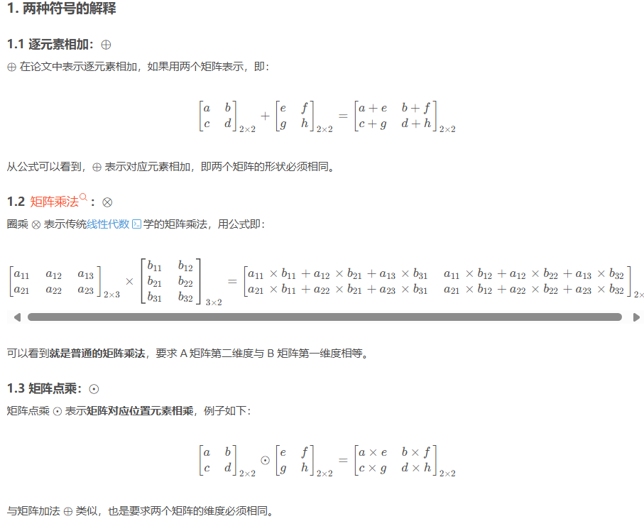
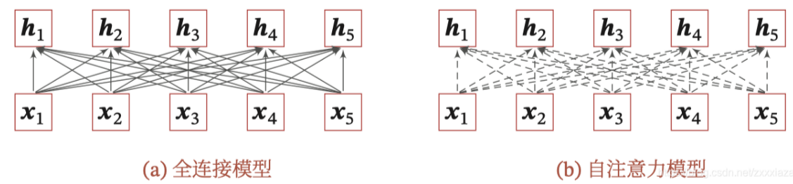

# 注意力机制

自下而上：不用主动关注，自带显著特征，只要我们的输入信息刺激性足够强，就能被关注到，而且对周围信息有抑制效应

自上而下：有明显关注的任务，带着任务从输入信息中选择一个信息出来（即我们此处讨论的**attention**）

## 人工神经网络的注意力机制

**soft  attention**

注意力机制的计算可以分为两步：

1. 在所有输入信息上计算**注意力分布**，
2. 根据注意力分布计算输入信息的**加权平均**。

**注意力分布**

- **注意力打分函数**$s(x_n, q)$: 用于计算输入元素 $x_n$ 和查询向量 $q$ 的相似性或相关性$（s 即 similarity）$。
- **注意力分布** $\alpha_n$: 表示输入序列元素 $x_n$ 对查询向量 $q$ 的重要性权重。
- 

 

**连续函数，方便求导**

打分函数$s(x_n,q)$ ：**计算x和q的相似度**

**hard attention**：一般不考虑，离散无法求导

**键值对注意力  key-value pair attention**

**多头注意力  multi-head attention**

**符号解释**

**指针网络**

## 自注意力机制

虽然循环网络理论上可以建立长距离依赖关系，但由于信息传递的容量以及梯度消失问题，实际上也只能建立短距离依赖关系。

如果要建立序列之间的长距离依赖关系，可以使用以下两种方法：
1）增加物理的层数，通过一个深层网络来获取远距离的信息交互；
2）使用全连接网络。

全连接网络是一种非常直接的建模远距离依赖的模型，但是无法处理变长的输入序列，不同的输入长度，其连接权重的大小也不同。这时我们可以利用注意力机制来“动态”的生成不同连接的权重，这就是自注意力模型$（self-attention model）$。自注意力模型更容易捕获中长距离的相互依赖关系。

为提高模型能力，自注意力模型经常采用查询-键-值$（query-key-velue，QKV）$模式，其计算过程如下图所示，其中红色字母表示矩阵的维度。

**下图为全连接模型和自注意力模型的对比，实线表示可学习的权重，虚线表示动态生成的权重。由于自注意力模型的权重是动态生成的，因此可以处理变长的信息序列。**

## Transformer

