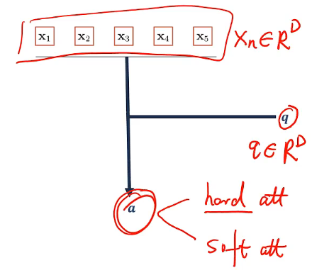
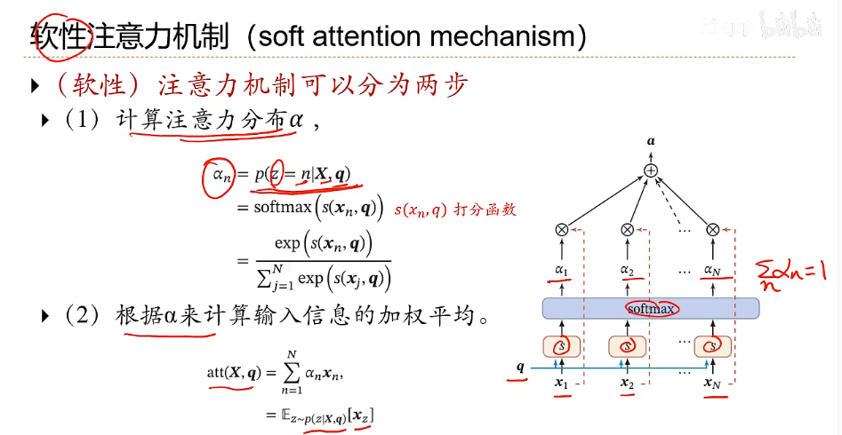
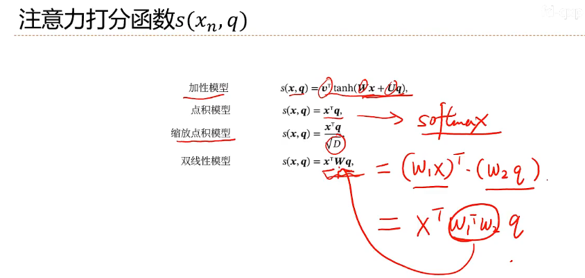
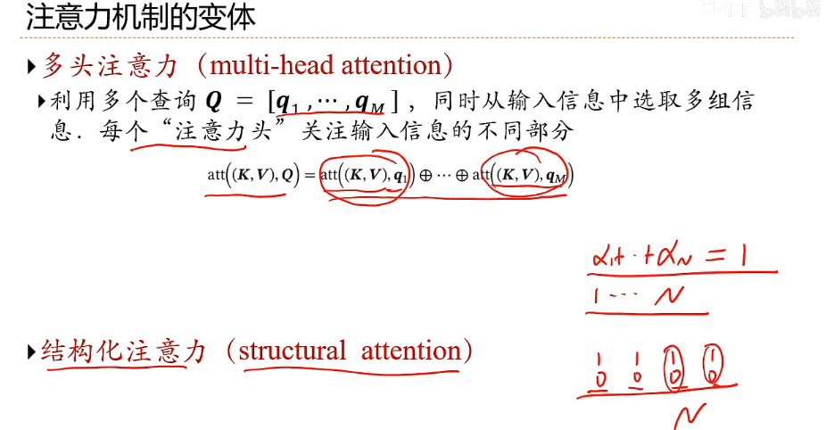
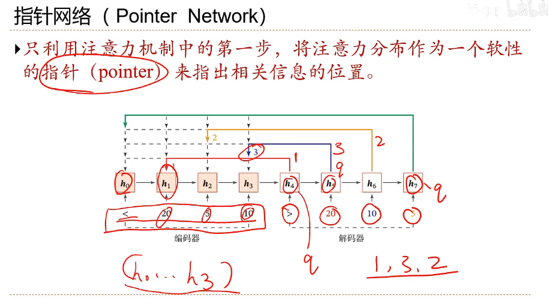

# 注意力机制

自下而上：不用主动关注，自带显著特征，只要我们的输入信息刺激性足够强，就能被关注到，而且对周围信息有抑制效应

自上而下：有明显关注的任务，带着任务从输入信息中选择一个信息出来（即我们此处讨论的**attention**）

## 人工神经网络的注意力机制

**soft  attention**

 

**连续函数，方便求导**

打分函数$s(x_n,q)$ ：**计算x和q的相似度**

**hard attention**：一般不考虑，离散无法求导

**键值对注意力  key-value pair attention**

**多头注意力  multi-head attention**

**指针网络**

## Transformer
