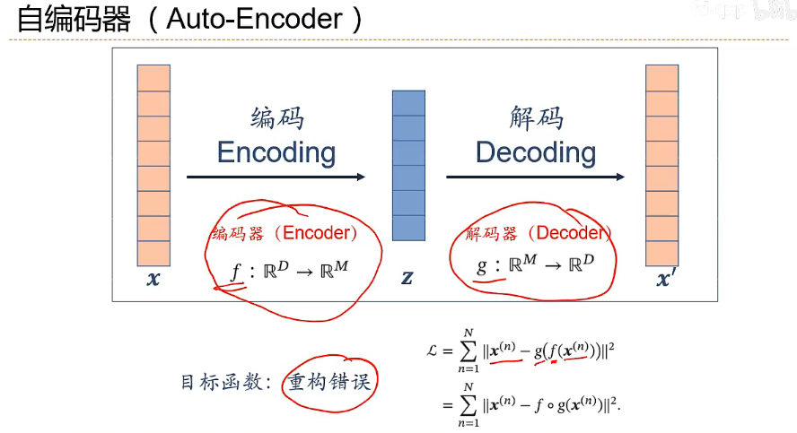
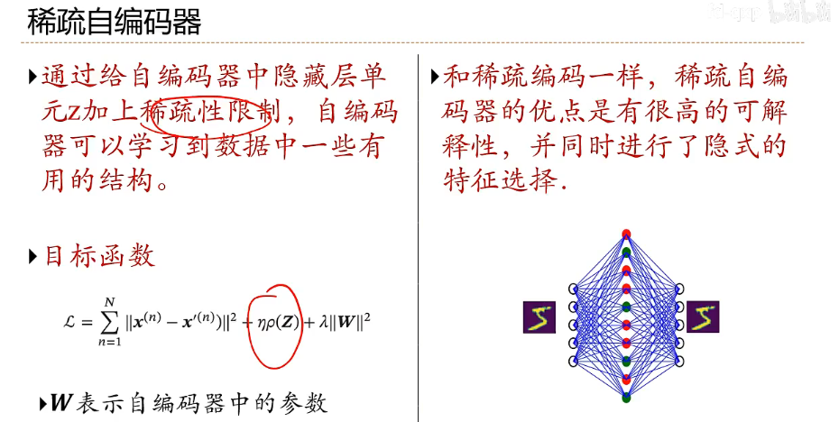
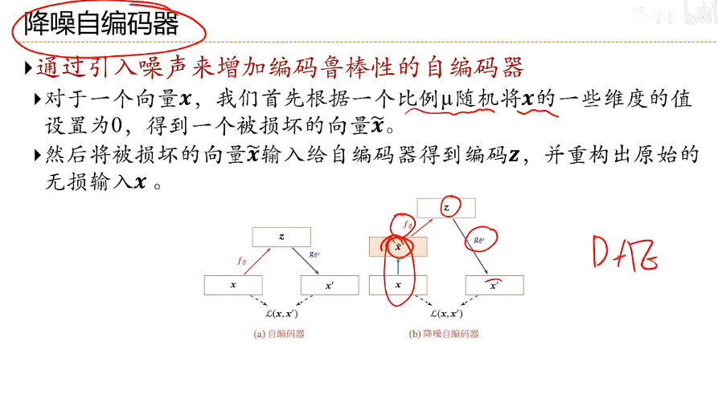

## 编码器

### 自编码器

**两层网络结构的自编码器**

**稀疏编码**

**稀疏自编码器**

**降噪自编码器Denoising autoencoder**

### VAE

变分自编码器（Variational Autoencoder, VAE）是一种生成模型，其目标是学习数据的潜在分布 $ p(x) $，并可以从中生成新的样本。为了实现这一点，我们需要最大化数据的对数边际似然 $ \log p(x) $。

#### 1. 问题背景

变分自编码器（Variational Autoencoder, VAE）是一种生成模型，其目标是学习数据的潜在分布 \( p(x) \)，并可以从中生成新的样本。为了实现这一点，我们需要最大化数据的对数边际似然 \( \log p(x) \)。

#### 2. 数据生成过程和模型假设

VAE 的生成过程可以描述为以下两步：

1. 从先验分布 \( p(z) \) 中采样潜在变量 \( z \)；
2. 根据条件概率 \( p(x|z) \) 从潜在变量生成观测数据 \( x \)。

因此，数据的边际分布为：
\[
p(x) = \int p(x|z)p(z) \, dz
\]

#### 3. 变分下界

直接计算 \( \log p(x) \) 通常不可行，因为积分 \( \int p(x|z)p(z) \, dz \) 无法解析。为此，VAE 引入了一个近似后验分布 \( q(z|x) \)，并使用变分推断优化。

对数边际似然可以分解为两部分：
\[
\log p(x) = \mathbb{E}_{q(z|x)} \left[ \log \frac{p(x, z)}{q(z|x)} \right] + D_{\mathrm{KL}}(q(z|x) \| p(z|x))
\]

其中：
- 第一项 \( \mathbb{E}_{q(z|x)} \left[ \log \frac{p(x, z)}{q(z|x)} \right] \) 是变分下界（ELBO, Evidence Lower BOund）；
- 第二项 \( D_{\mathrm{KL}}(q(z|x) \| p(z|x)) \) 是 KL 散度，表示近似后验与真实后验的差异。

由于 KL 散度是非负的，可以得到以下不等式：
\[
\log p(x) \geq \mathbb{E}_{q(z|x)} \left[ \log \frac{p(x, z)}{q(z|x)} \right]
\]

为了优化 \( \log p(x) \)，我们最大化 ELBO：
\[
\mathrm{ELBO} = \mathbb{E}_{q(z|x)} \left[ \log p(x|z) \right] - D_{\mathrm{KL}}(q(z|x) \| p(z))
\]

#### 4. 损失函数

从 ELBO 的定义可以推导出 VAE 的损失函数：
\[
\mathcal{L}_{\text{VAE}} = - \mathbb{E}_{q(z|x)} [\log p(x|z)] + D_{\mathrm{KL}}(q(z|x) \| p(z))
\]

- 第一项 \( - \mathbb{E}_{q(z|x)} [\log p(x|z)] \)：重构误差，衡量生成数据 \( p(x|z) \) 与真实数据 \( x \) 的相似性；
- 第二项 \( D_{\mathrm{KL}}(q(z|x) \| p(z)) \)：正则化项，约束 \( q(z|x) \) 接近先验分布 \( p(z) \)。

#### 5. 具体步骤

##### 5.1. 编码器（Encoder）

编码器近似后验分布 \( q(z|x) \)，通常假设为高斯分布 \( \mathcal{N}(z; \mu_\phi(x), \sigma^2_\phi(x)) \)，均值和方差由神经网络参数化：
\[
q(z|x) = \mathcal{N}(z; \mu_\phi(x), \sigma^2_\phi(x))
\]

##### 5.2. 重参数化技巧

为了使采样 \( z \sim q(z|x) \) 可微，引入重参数化技巧，将 \( z \) 表示为：
\[
z = \mu_\phi(x) + \sigma_\phi(x) \odot \epsilon, \quad \epsilon \sim \mathcal{N}(0, I)
\]

这样，通过对 \( \epsilon \) 采样，网络的梯度可以通过 \( \mu_\phi(x) \) 和 \( \sigma_\phi(x) \) 传播。

##### 5.3. 解码器（Decoder）

解码器通过条件概率分布 \( p(x|z) \) 生成数据 \( x \)，其分布参数同样由神经网络输出。

---

#### 6. 总结

VAE 通过最大化以下变分下界（ELBO）来学习数据分布：
\[
\mathrm{ELBO} = \mathbb{E}_{q(z|x)} \left[ \log p(x|z) \right] - D_{\mathrm{KL}}(q(z|x) \| p(z))
\]

损失函数中的两部分分别对应数据重构误差和正则化约束。其关键创新包括：
1. 使用重参数化技巧实现可微采样；
2. 引入变分推断框架优化复杂的生成模型。

通过学习潜在空间的分布，VAE 不仅可以生成高质量的样本，还能为数据提供有意义的潜在表示。

## 密度估计-深度生成网络

**密度估计**：拟合输入数据的边缘分布 $P(x)$。

### 玻尔兹曼机

### 受限玻尔兹曼机

### 深度信念网络

### 生成对抗网络