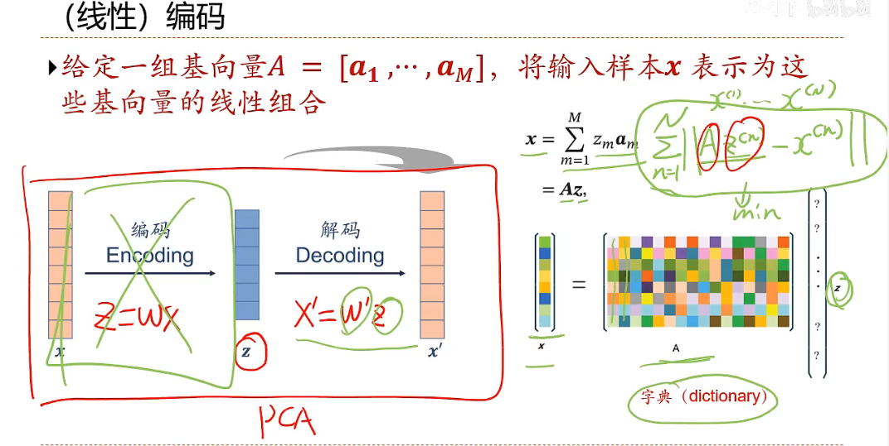
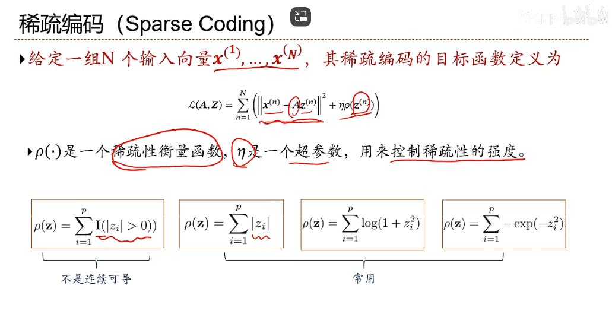
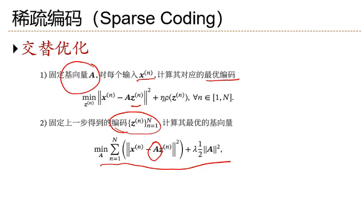
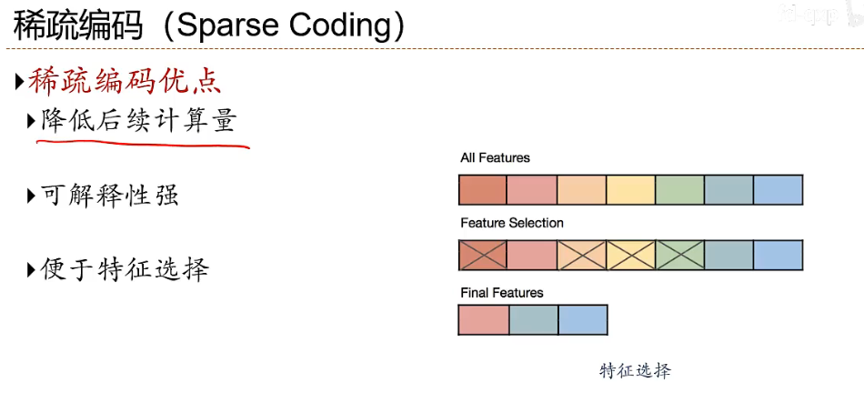
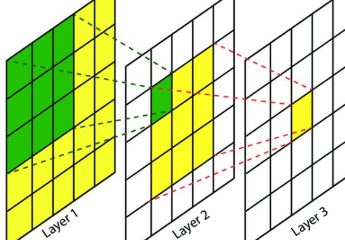
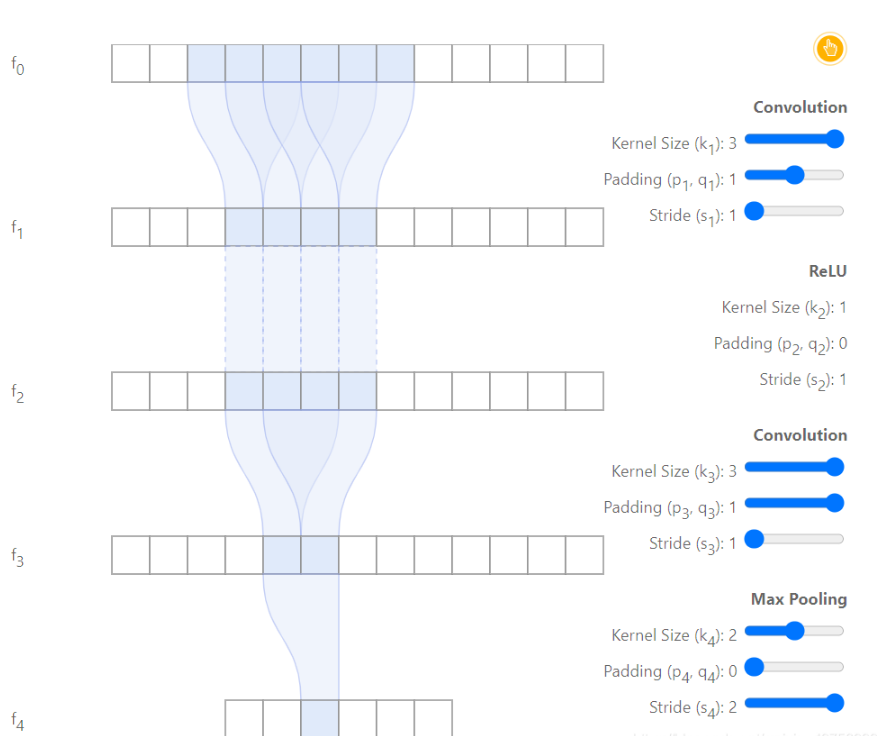

# 无监督模型

无监督学习模型可以大致分为 **生成模型** 和 **非生成模型（判别模型）** 两类：

1. 生成模型（Generative Models）
   - 目标：学习数据的**概率分布** $p(x)$ 或联合分布 $p(x,z)$（其中 $z$ 是潜变量）。
   - 生成数据：可以从学习到的分布中**采样**新数据点。
   - 典型算法：
     - **高斯混合模型（GMM, Gaussian Mixture Model）**
     - **主成分分析（PCA, Principal Component Analysis）**
     - **自编码器（Autoencoder）**
     - **变分自编码器（VAE, Variational Autoencoder）**
     - **生成对抗网络（GAN, Generative Adversarial Network）**
2. 非生成模型（判别模型，Discriminative Models）
   - 目标：学习数据点之间的**相似性、结构或分类边界**，而不是数据本身的分布。
   - 不能生成新数据，只能用于任务如**聚类或降维**。
   - 典型算法：
     - **K-Means 聚类**
     - **DBSCAN**
     - **层次聚类（Hierarchical Clustering）**
     - **t-SNE（降维方法）**
     - **UMAP（降维方法）**

在无监督学习中，**生成模型通常更复杂**，因为它们不仅要理解数据，还要能生成数据；而**非生成模型更注重数据的结构或分类**。

---

**非生成模型通常指的是判别模型。在机器学习中，判别模型关注的是给定输入特征的条件下，直接预测输出标签的概率分布。例如，逻辑回归、支持向量机(SVM)、神经网络等都是典型的判别模型。**

**与之相对的是生成模型，生成模型会学习输入数据和输出标签的联合分布，即它试图捕捉数据的生成过程。例如，朴素贝叶斯、隐马尔可夫模型(HMM)以及生成对抗网络(GAN)等都是生成模型。**

**判别模型的目标是直接学习决策边界，而生成模型则是学习如何生成数据及其对应的标签。**

## 非生成模型（判别模型）

非生成模型主要关心数据的**表示或聚类**，无需建模$p(x)$ 或$p(x,z)$。其目标是直接挖掘数据结构或寻找数据的低维表示。

- $x$ 表示观测数据。

- $z$ 表示潜在变量（如果有的话）。

### **特点**

1. **建模重点不同**：
   - 关注数据的几何结构或统计关系，而非完整的生成机制。
   - 不建模联合分布，通常优化直接与数据相关的目标函数。
2. **无需生成样本**：
   - 非生成模型不需要生成新样本，而是专注于描述或分析已有数据。
3. **效率较高**：
   - 不需要复杂的积分或采样过程，模型的计算通常较生成模型简单。

### **典型模型**

- 聚类模型：
  - $K$-均值（$K$-means）：直接基于欧几里得距离将数据分为 K个簇。
  - 层次聚类：构建数据的分层聚类树。
- 降维模型：
  - 主成分分析（$PCA$）：通过线性变换找到数据的低维表示。
  - 核$PCA$：利用核方法处理非线性关系。

## 编码器

### 自编码器

**两层网络结构的自编码器**

#### **稀疏编码**

**A是在所有的样本上共享学习的**

**交替优化**

**优点**

#### **感受野**

就是指输出feature map上某个元素受输入图像上影响的区域

Layer2由一个3\*3的卷积核经过卷积运算输出，输出尺寸是3\*3（假设stride=1，padding=0）显而易见，layer2中的绿色方格是由layer1中3*3的绿色方格所决定的。那么这一位置的感受野就是layer1中的绿色方格区域

**如何计算?**

卷积层的理想感受野可以由递推公式计算出来。首先定义下列参数意义，$r$代表感受野，$r$表示层级$k$代表卷积核大小，$s$代表步长

$$
r_1 = r_{1-1} + (k_1 - 1) \prod_{i=0}^{l-1} s_i
$$

最大池化层的理想感受野

$$
r_1 = r_{1-1} + (k_1 - 1)
$$

---

图中，由1个conv$3*3$（stride=1, pad=1），1个ReLu层，1个$2*2$MaxPooling层（k=2, s=2, p=0）组成。很明显能够发现，$f_4$层的感受野为6。推导过程如下

1. $f_1$默认感受野为1，即$r_0 = 1$
2. $f_2$层为$3*3$conv层，$r_1 = r_0 + (k_1 - 1) \prod_{i=0}^{0} s_i$，即$1 + (3 - 1) * 1 = 3$
3. $f_3$层激活函数层ReLu，不变化理想感受野大小（它不是作用，用有效感受野里面提到的作用）$r_2 = 3$
4. $f_4$层为$3*3$conv层，和上一个conv层一样，$r_3 = 3 + (3 - 1) * 1 = 5$
5. $f_5$层$2*2$maxpooling层，$r_4 = 5 + (2 - 1) = 6$

**稀疏自编码器**

**降噪自编码器Denoising autoencoder**

**标准自编码器（AE）本身不是典型的生成模型**，因为：

- **AE 主要用于特征学习和降维**，它学习数据的**低维表示**（latent representation），但并不直接建模数据的概率分布 $p(x)$。
- **AE 不能直接生成新数据**，因为解码器通常只能复原输入数据，而不能从潜在空间中自由采样生成全新的数据。

==如果你的重点是**生成数据**，那么 VAE、AAE 更适合作为深度生成模型，而标准 AE 仅用于降维和特征提取。==

## 密度估计-生成模型

生成模型通过建模数据的联合分布 $p(x,z)$ 或 $p(x)$，其中：$x $表示观测数据。$z$ 表示潜在变量（如果有的话）。其目标是学习到数据的分布结构，从而能够生成新样本。

**密度估计**：拟合输入数据的边缘分布 $P(x)$。

深度生成网络是一类机器学习模型，旨在生成与训练数据相似的数据。这些网络在图像生成、文本生成、音乐生成等领域有广泛应用。常见的深度生成网络包括变分自动编码器（VAE）、生成对抗网络（GAN）以及结合两者优点的VAE-GAN。

### 变分自编码器(VAE)

变分自编码器（Variational Autoencoder, VAE）是一种生成模型，其目标是学习数据的潜在分布 $ p(x) $，并可以从中生成新的样本。为了实现这一点，我们需要最大化数据的对数边际似然 $ \log p(x) $。

#### 1. 问题背景

变分自编码器（Variational Autoencoder, VAE）是一种生成模型，其目标是学习数据的潜在分布 $ p(x) $，并可以从中生成新的样本。为了实现这一点，我们需要最大化数据的对数边际似然 $ \log p(x) $。

#### 2. 数据生成过程和模型假设

VAE 的生成过程可以描述为以下两步：

1. 从先验分布 $ p(z) $ 中采样潜在变量 $ z $；
2. 根据条件概率 $ p(x|z) $ 从潜在变量生成观测数据 $ x $。

因此，数据的边际分布为：
$
p(x) = \int p(x|z)p(z) \, dz
$

#### 3. 变分下界

直接计算 $ \log p(x) $ 通常不可行，因为积分 $ \int p(x|z)p(z) \, dz $ 无法解析。为此，VAE 引入了一个近似后验分布 $ q(z|x) $，并使用变分推断优化。

对数边际似然可以分解为两部分：
$
\log p(x) = \mathbb{E}_{q(z|x)} \left[ \log \frac{p(x, z)}{q(z|x)} \right] + D_{\mathrm{KL}}(q(z|x) \| p(z|x))
$

其中：

- 第一项 $ \mathbb{E}_{q(z|x)} \left[ \log \frac{p(x, z)}{q(z|x)} \right] $ 是变分下界（ELBO, Evidence Lower BOund）；
- 第二项 $ D_{\mathrm{KL}}(q(z|x) \| p(z|x)) $ 是 KL 散度，表示近似后验与真实后验的差异。

由于 KL 散度是非负的，可以得到以下不等式：
$
\log p(x) \geq \mathbb{E}_{q(z|x)} \left[ \log \frac{p(x, z)}{q(z|x)} \right]
$

为了优化 $ \log p(x) $，我们最大化 ELBO：
$
\mathrm{ELBO} = \mathbb{E}_{q(z|x)} \left[ \log p(x|z) \right] - D_{\mathrm{KL}}(q(z|x) \| p(z))
$

#### 4. 损失函数

从 ELBO 的定义可以推导出 VAE 的损失函数：
$
\mathcal{L}_{\text{VAE}} = - \mathbb{E}_{q(z|x)} [\log p(x|z)] + D_{\mathrm{KL}}(q(z|x) \| p(z))
$

- 第一项 $ - \mathbb{E}_{q(z|x)} [\log p(x|z)] $：重构误差，衡量生成数据 $ p(x|z) $ 与真实数据 $ x $ 的相似性；
- 第二项 $ D_{\mathrm{KL}}(q(z|x) \| p(z)) $：正则化项，约束 $ q(z|x) $ 接近先验分布 $ p(z) $。

#### 5. 具体步骤

##### 5.1. 编码器（Encoder）

编码器近似后验分布 $ q(z|x) $，通常假设为高斯分布 $ \mathcal{N}(z; \mu_\phi(x), \sigma^2_\phi(x)) $，均值和方差由神经网络参数化：
$
q(z|x) = \mathcal{N}(z; \mu_\phi(x), \sigma^2_\phi(x))
$

##### 5.2. 重参数化技巧

为了使采样 $ z \sim q(z|x) $ 可微，引入重参数化技巧，将 $ z $ 表示为：
$
z = \mu_\phi(x) + \sigma_\phi(x) \odot \epsilon, \quad \epsilon \sim \mathcal{N}(0, I)
$

这样，通过对 $ \epsilon $ 采样，网络的梯度可以通过 $ \mu_\phi(x) $ 和 $ \sigma_\phi(x) $ 传播。

##### 5.3. 解码器（Decoder）

解码器通过条件概率分布 $ p(x|z) $ 生成数据 $ x $，其分布参数同样由神经网络输出。

---

#### 6. 总结

VAE 通过最大化以下变分下界（ELBO）来学习数据分布：
$
\mathrm{ELBO} = \mathbb{E}_{q(z|x)} \left[ \log p(x|z) \right] - D_{\mathrm{KL}}(q(z|x) \| p(z))
$

损失函数中的两部分分别对应数据重构误差和正则化约束。其关键创新包括：

1. 使用重参数化技巧实现可微采样；
2. 引入变分推断框架优化复杂的生成模型。

通过学习潜在空间的分布，VAE 不仅可以生成高质量的样本，还能为数据提供有意义的潜在表示。

### 生成对抗网络(GAN)

### 玻尔兹曼机(BM)

### 受限玻尔兹曼机(RBM)

 

### 深度信念网络(DBN)

**深度置信网络组成元件是受限玻尔兹曼机。**

## 高斯混合模型（GMM）

高斯混合模型（Gaussian Mixture Model，GMM）是一种概率模型，假设所有的观测数据都是由多个高斯分布（正态分布）的混合生成的。每个高斯分布表示数据的一部分，而整体的模型则是这些高斯分布的加权和。GMM 是一种常用于聚类分析的无监督学习算法。

### 数学表达

GMM 由一组高斯分布加权组合而成，每个高斯分布有一个均值 $\mu_k$ 和协方差矩阵 $\Sigma_k$，以及一个权重 $\pi_k$，其中 $k$ 表示高斯分布的索引。其概率密度函数（PDF）为：

$$
p(x) = \sum_{k=1}^{K} \pi_k \mathcal{N}(x | \mu_k, \Sigma_k)
$$

其中：

- $K$ 是高斯分布的个数（即混合组件的数量）

- $\pi_k$ 是第 $k$ 个高斯分布的权重，满足 $\sum_{k=1}^{K} \pi_k = 1$

- $\mathcal{N}(x | \mu_k, \Sigma_k)$ 表示第 $k$ 个高斯分布的概率密度函数，通常写为：
  $$
  \mathcal{N}(x | \mu_k, \Sigma_k) = \frac{1}{(2\pi)^{d/2} |\Sigma_k|^{1/2}} \exp\left(-\frac{1}{2}(x - \mu_k)^T \Sigma_k^{-1} (x - \mu_k)\right)
  $$

  其中 $d$ 是数据的维度。

### 模型的估计（EM算法）

高斯混合模型的目标是根据给定的数据集，估计出每个高斯分布的参数（均值 $\mu_k$，协方差矩阵 $\Sigma_k$，权重 $\pi_k$）。这一过程通常通过**期望最大化（EM）算法**来完成。

#### 1. E步（期望步，Expectation step）

在这一步中，使用当前模型参数计算每个数据点属于每个高斯分布的后验概率（即责任度）。该概率表示每个数据点属于不同高斯分布的可能性：

$$
\gamma(z_{ik}) = \frac{\pi_k \mathcal{N}(x_i | \mu_k, \Sigma_k)}{\sum_{k=1}^{K} \pi_k \mathcal{N}(x_i | \mu_k, \Sigma_k)}
$$

#### 2. M步（最大化步，Maximization step）

在这一步中，使用 E 步计算得到的责任度，重新估计模型参数。更新公式为：

- 均值更新：
  $$
  \mu_k = \frac{\sum_{i=1}^{N} \gamma(z_{ik}) x_i}{\sum_{i=1}^{N} \gamma(z_{ik})}
  $$

- 协方差更新：
  $$
  \Sigma_k = \frac{\sum_{i=1}^{N} \gamma(z_{ik}) (x_i - \mu_k)(x_i - \mu_k)^T}{\sum_{i=1}^{N} \gamma(z_{ik})}
  $$

- 权重更新：
  $$
  \pi_k = \frac{1}{N} \sum_{i=1}^{N} \gamma(z_{ik})
  $$

### GMM 的应用

- **聚类**：GMM 可以用于聚类任务，尤其是当数据呈现高斯分布时，GMM 比 K-means 更适合，因为它能够处理不同形状的簇。
- **密度估计**：GMM 可以用来对数据进行概率密度估计，建模复杂的数据分布。
- **异常检测**：通过计算数据点的生成概率，GMM 可以用于识别与数据分布不匹配的异常点。

### 优缺点

**优点**：

- 可以处理不同形状的簇，而 K-means 只能处理球形簇。
- 可以为每个数据点分配一个隶属度，而不仅仅是硬分配。

**缺点**：

- 需要预先设定混合成分的数量 $K$。
- 对初始值敏感，可能会陷入局部最优解。
- 计算复杂度相对较高，尤其是在高维数据中。

## EM算法

