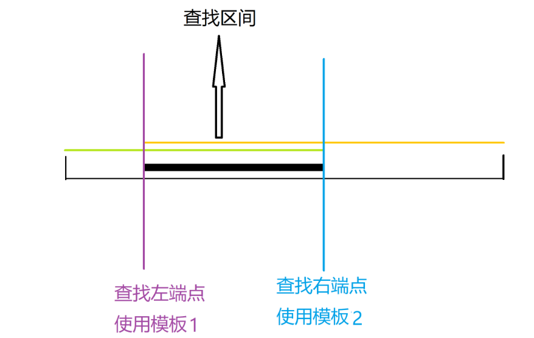

# 二分



```c++
//模板1
while (l < r){
    int mid = l + r >> 1;
    if (a[mid] >= x) r = mid;
    else l = mid + 1;
}
        
//模板2

while(l < r){
    int mid = l + r + 1 >> 1;
    if (a[mid] <=x) l = mid;
    else r = mid -1;
}
```

### 数的范围

```c++
#include<iostream>
#include<cstring>
#include<algorithm>

using namespace std;

const int N=1e5+10;

int a[N];
int n,q;

int main(){
    cin>>n>>q;
    
    for(int i=0;i<n;i++){
        cin>>a[i];
    }
    
    while(q--){
        int x;
        cin>>x;
        
        int l=0,r=n-1;
        
        while (l < r){
            int mid = l + r >> 1;
            if (a[mid] >= x) r = mid;
            else l = mid + 1;
        }
        
        if(a[l]!=x){
            cout<<"-1 -1"<<endl;
            continue;
        }
        
        cout<<r<<' ';
        l=0,r=n-1;
        while(l < r){
            int mid = l + r + 1 >> 1;
            if (a[mid] <=x) l = mid;
            else r = mid -1;
        }
        cout<<r<<endl;
    }
    
    return 0;
}
```

