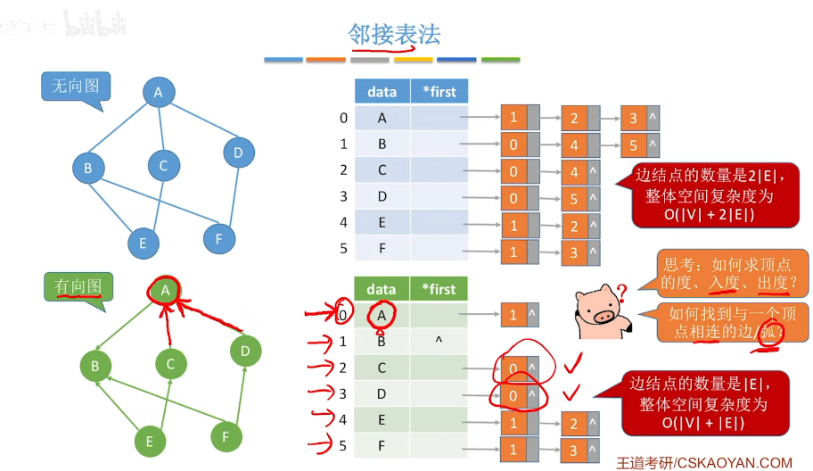

## 图的存储

**图的边从节点a到节点b，权重为c**

### 直接存边
使用一个 vector 来存边，数组中的每个元素都包含了一条边的起点与终点（带边权的图还包含边权）。

```c++
struct Edge {
    int a, b, c;
};

int main() {
    int n, m;
    //（n个点，m条边）
    cin >> n >> m;
    
    vector<Edge> edges(m);  // 也可以先声明为全局变量，然后通过resize调整
	for (int i = 0; i < m; i++)
   	cin >> edges[i].a >> edges[i].b >> edges[i].c;
	
	return 0;
}
```
### 邻接矩阵


```c++
int g[N][N];

int main() {
    int n, m;
    cin >> n >> m;
    while (m--) {
        int a, b, c;
        cin >> a >> b >> c;
        g[a][b] = c;
    }
    return 0;
}
```

### 邻接表



使用一个支持动态增加元素的数据结构构成的数组
```c++
vector<pair<int, int>> adj[N];

int main() {
    int n, m;
    cin >> n >> m;
    while (m--) {
        int a, b, c;
        cin >> a >> b >> c;
        adj[a].push_back({b, c});
    }
    return 0;
}
```

### 链式向量法
之前的邻接表是基于 vector 来实现的，如果把 vector 换成用数组实现的链表，效率将会提高很多，而这样实现的邻接表又被称为链式向量。

```c++
int h[N], e[N], ne[N], idx;  // e相当于val，ne相当于nxt
int w[N];  // 用来存储每条边的权重

//向图中添加a到b的有向边，权重为c
//idx代表边号
//h代表链表的结点
//h[a] = idx++  点a的起点是idx这条边
void add(int a, int b, int c) {
    e[idx] = b, w[idx] = c, ne[idx] = h[a], h[a] = idx++;
}

int main() {
    memset(h, -1, sizeof(h));  // 使用链式前向星必须进行初始化

    int n, m;
    cin >> n >> m;
    while (m--) {
        int a, b, c;
        cin >> a >> b >> c;
        add(a, b, c);
    }
    
    return 0;
}
```

**重点：ne和h都是存的是边，n存的是边终点**

**遍历**

```c++
for (int i = h[k]; i != -1; i = ne[i]){
    
}
```

## 树的重心

给定一颗树，树中包含 n个结点（编号 1∼n）和 n−1 条无向边。请你找到树的重心，并输出将重心删除后，剩余各个连通块中点数的最大值。

**树的重心定义**：在一棵树中，一个节点被称为**重心**（Centroid），如果将这个节点删除后，剩余的树分解成若干个连通块。重心的定义是这样的：删除该节点后，所有的连通块中最大连通块的节点数最小。如果一个节点符合这个条件，那么这个节点被称为树的重心。

```C++
#include<iostream>
#include<algorithm>
#include<cstring>
#include<cstdio>

using namespace std;
const int N=1e5+10;

const int M=N*2;//最多N个节点，最多M条边;

int h[N],e[M],ne[M],idx;//e存值，ne存下一个点的地址,h存链表的头
int ans=N;
bool st[N];
int n;
void add(int a,int b){//建立单向边，从a至b
    e[idx]=b;
    ne[idx]=h[a];
    h[a]=idx++;
}

int dfs(int u){//求节点u所有子节点的sum
    st[u]=true;
    int size = 0, sum = 0;
    
    for(int i=h[u];i!=-1;i=ne[i]){
        int j=e[i];
        if(st[j])   continue;
        int s=dfs(j);
        
        size=max(size,s);//节点u  子节点森林  的最大值
        
        sum += s;
    }
    
    //cout<<n-sum-1<<endl;
    size=max(size,n-sum-1);
  
    ans=min(ans,size);
    
    return sum + 1;
}

int main(){
    cin>>n;
    memset(h,-1,sizeof(h));//将每个节点的链表设置为空
    for(int i=0;i<n-1;i++){
        int x,y;
        cin>>x>>y;
        add(x,y);
        add(y,x);
    }
    
    dfs(1);
    cout<<ans<<endl;
    
    return 0;
}

```

## 图中点的层次

给定一个有向图，图中可能存在重边和自环。图中有 `n` 个点和 `m` 条边，边的长度均为 1。点的编号从 1 到 `n`。我们需要计算从点 1 到点 `n` 的最短距离。如果点 1 到点 `n` 不可达，则输出 `-1`。

为了解决从点 1 到点 `n` 的最短路径问题，适合使用广度优先搜索（BFS）算法。BFS 能够在图中找到从源点到目标点的最短路径，因为它在每一层中都会访问距离当前节点相同的所有节点。

1. **初始化**：
   - 使用 `queue` 进行广度优先搜索。
   - 将起始点 1 入队，并将其距离设置为 0：`d[1] = 0`。
   - 其他所有点的初始距离设置为 -1，表示尚未访问。

2. **BFS 过程**：
   - 从队列中取出当前节点 `t`。
   - 遍历节点 `t` 的所有邻接点 `j`：
     - 如果点 `j` 尚未访问（即 `d[j] == -1`），则更新点 `j` 的距离为 `d[t] + 1`，并将点 `j` 入队。
   - 如果在 BFS 遍历过程中发现点 `n` 的距离已经被更新（即 `d[n] != -1`），直接输出其距离并返回。
   - 如果 BFS 遍历完成仍未访问到点 `n`，则输出 `-1`。


```c++
#include<iostream>
#include<algorithm>
#include<queue>
#include<cstring>

using namespace std;

const int N=1e5+10;

int n,m;
int h[N],e[N],ne[N],idx;
int d[N];

void add(int a,int b){
    e[idx]=b;
    ne[idx]=h[a];
    h[a]=idx++;
}

void bfs(){
    queue<int> q;
    q.push(1);
    d[1]=0;
    
    while(q.size()){
        if(d[n]!=-1){
            cout<<d[n];
            return;
        }
        int t=q.front();
        q.pop();
        
        for(int i=h[t];i!=-1;i=ne[i]){
            int j=e[i];
            if(d[j]==-1){
                q.push(j);
                d[j]=d[t]+1;
            }
        } 
    }
    
    cout<<"-1"<<endl;
    return;
}

int main(){
    cin>>n>>m;
    memset(h,-1,sizeof(h));
    memset(d,-1,sizeof(d));
    
    for(int i=0;i<m;i++){
        int a,b;
        cin>>a>>b;
        add(a,b);
    }
    
    bfs();
    
    return 0;
}

```


