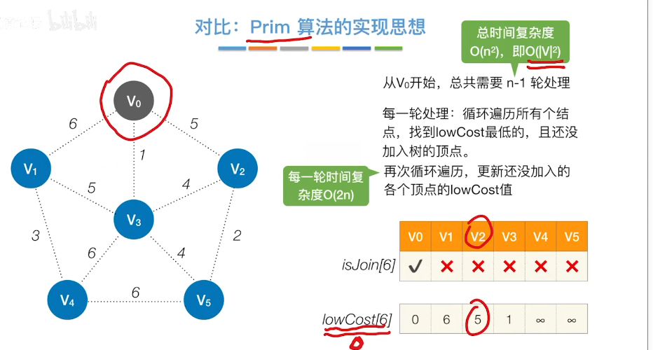

# Prim

**算法思路**

**由已经组合好的点集去匹配  直接连接该集合的点（该点还不属于该集合）**



```c++
#include <cstring>
#include <iostream>
#include <algorithm>

using namespace std;

const int N = 510, INF = 0x3f3f3f3f;

int n, m;
int g[N][N];
int dist[N];
bool st[N];


int prim()
{
    memset(dist, 0x3f, sizeof dist);

    int res = 0;
    for (int i = 0; i < n; i ++ )
    {
        int t = -1;
        for (int j = 1; j <= n; j ++ )
            if (!st[j] && (t == -1 || dist[t] > dist[j]))
                t = j;

        if (i && dist[t] == INF) return INF;		
        
        if (i) res += dist[t];
        st[t] = true;
        
        //将选出的点遍历一遍，更新连接集合的边，让边的长度达到最小值
        for (int j = 1; j <= n; j ++ ) dist[j] = min(dist[j], g[t][j]);
    }

    return res;
}


int main()
{
    scanf("%d%d", &n, &m);

    memset(g, 0x3f, sizeof g);

    while (m -- )
    {
        int a, b, c;
        scanf("%d%d%d", &a, &b, &c);
        g[a][b] = g[b][a] = min(g[a][b], c);
        //需要赋值两次，无向图
    }

    int t = prim();

    if (t == INF) puts("impossible");
    else printf("%d\n", t);

    return 0;
}

```

