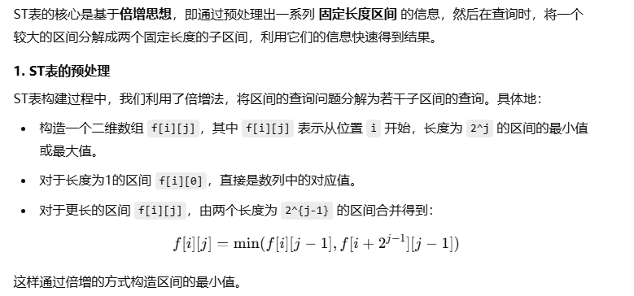
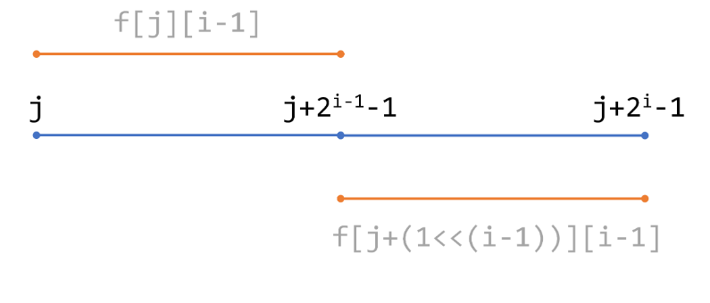
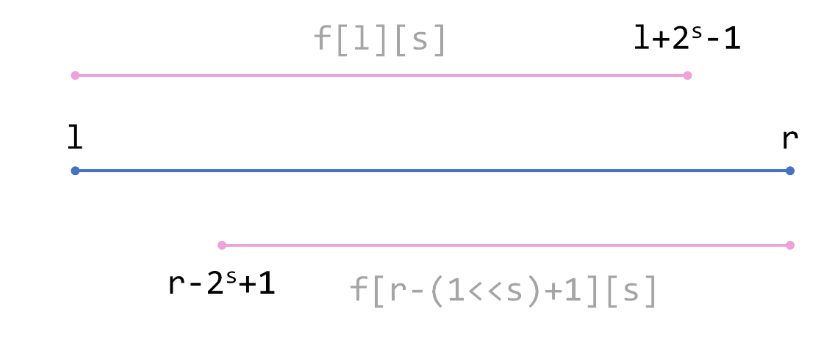

# ST表

**ST表**（Sparse Table，**稀疏表**）是一种简单的数据结构，主要用来解决**RMQ**（Range Maximum/Minimum Query，**区间最大/最小值查询**）问题。它主要应用**倍增**的思想，可以实现`O(nlog⁡n) `预处理、 `O(1)` 查询。

所谓RMQ问题，以最大值为例，是假如有一个数列 `A`，给你一个区间 `[l,r] `，要求`max(Ai)`，其中`i∈[l,r]`。

## ST表的预处理



本文中的区间都是离散意义下的，只包含整数，所以此区间也可以写成**[i,i+2<sup>j</sup>−1]**，这称为**预处理**。查询时，再利用这些子区间算出待求区间的最大值。

```cpp
int f[MAXN][21]; // 第二维的大小根据数据范围决定，不小于log(MAXN)
for (int i = 1; i <= n; ++i)
    f[i][0] = read(); // 读入数据
for (int i = 1; i <= 20; ++i)
    for (int j = 1; j + (1 << i) - 1 <= n; ++j)
        f[j][i] = max(f[j][i - 1], f[j + (1 << (i - 1))][i - 1]); //和图的i，j相反
```

**原理图**



## ST 表的查询

查询时我们要在 `[l,r]` 区间内找到最大值或最小值。由于 ST 表只能处理固定长度为 $2^k$ 的区间，因此我们将 `[l,r]` 区间分解成两个重叠的子区间：

- 一个是 [l, l + 2^s^ - 1]，长度为 $2^s$。
- 另一个是 [r - 2^s^ + 1, r]，长度也是 $2^s$。

通过这两个区间的最小值或最大值，我们就可以得到整个区间的查询结果。这里的 $s$ 取值为 $\lfloor \log_2 (r - l + 1) \rfloor$。

查询时，我们需要找到两个 `[l,r] `的子区间，它们的并集恰是 `[l,r]`（子区间可以相交）。具体地说，我们要找的是一个整数 s ，两个子区间分别为 **[l,l+2<sup>s</sup>−1]**和**[r−2<sup>s</sup>+1,r] **。

**原理图**



我们希望前一个子区间的右端点尽可能接近r。当**l+2<sup>s</sup>−1=r**时，有 `s=log2⁡(r−l+1) `（这时 **r−2<sup>s</sup>+1=l** 也成立）。

但因为s是整数，所以我们取 `s=⌊log2⁡(r−l+1)⌋ `。可以证明，这时两个子区间确实可以覆盖 [l,r] 。

每次计算log太花时间了，我们可以对log也进行一次递推的**预处理**：

#### **log~2~ 的预处理**

为了快速得到区间长度对应的 $s = \lfloor \log_2 (r - l + 1) \rfloor$，我们可以预先计算每个数的对数值，并存储在数组 `Log2` 中。这样查询时可以在 **O(1)** 时间内得到 $s$ 的值。

```cpp
for (int i = 2; i <= n; ++i)
    Log2[i] = Log2[i / 2] + 1;
```

在线查询的代码如下：

```cpp
for (int i = 0; i < m; ++i)
{
    int l = read(), r = read();
    int s = Log2[r - l + 1];
    printf("%d\n", max(f[l][s], f[r - (1 << s) + 1][s]));
}
```

## ST原理

其实ST表不仅能处理最大值/最小值，凡是符合**结合律**且**可重复贡献**的信息查询都可以使用ST表高效进行。什么叫可重复贡献呢？设有一个二元运算 f(x,y) ，满足 f(a,a)=a ，则f是可重复贡献的。显然最大值、最小值、最大公因数、最小公倍数、按位或、按位与都符合这个条件。可重复贡献的意义在于，可以对两个交集不为空的区间进行信息合并。

ST 表不仅可以处理最大值或最小值查询，任何符合**结合律**且**可重复贡献**的操作都可以通过 ST 表来处理。例如：

- 最大公因数 (GCD)
- 最小公倍数 (LCM)
- 按位与 (AND)
- 按位或 (OR)

这些操作都可以通过类似的方式使用 ST 表进行高效查询。只要两个区间的结果可以合并计算，就可以应用 ST 表。

##  **ST表的优缺点**

- 优点
  - 预处理时间是 **O(n log n)**，查询时间是 **O(1)**，非常高效。
  - 适合处理静态数据，即数据不会在查询过程中改变。
- 缺点
  - 空间复杂度较高，需要存储每个长度为 $2^k$ 的子区间信息，额外的存储开销为 **O(n log n)**。
  - 不支持动态修改数据，若数据需要频繁更新，使用**线段树**或**树状数组**会更合适。

