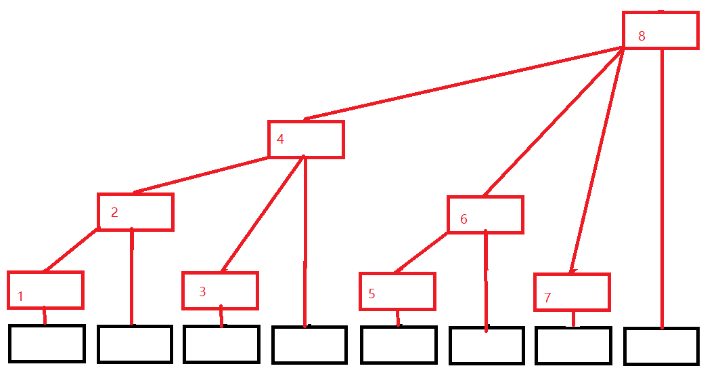

# 树状数组

## 树状数组存在意义

树状数组，也称作“二叉索引树”（Binary Indexed Tree）或 Fenwick 树。 它可以高效地实现如下两个操作：**1、数组前缀和的查询；2、单点更新**。

如果要执行“单点更新”，就得更新这个前缀和数组，又得计算一次前缀和，时间复杂度为 O(n)。

如果在一次业务场景中“前缀和”和“单点更新”的次数都很多，前缀和数组就不高效了。而 Fenwick 树就是“高效的”实现“前缀和”和“单点更新”这两个操作的数据结构。

## 树状数组性质(单点更新区间求和)



黑色数组代表原来的数组（下面用A[i]代替），红色结构代表我们的树状数组(下面用C[i]代替)，每个位置只有一个方框，令每个位置存的就是子节点的值的和，则有

- C[1] = A[1];
- C[2] = A[1] + A[2];
- C[3] = A[3];
- C[4] = A[1] + A[2] + A[3] + A[4];
- C[5] = A[5];
- C[6] = A[5] + A[6];
- C[7] = A[7];
- C[8] = A[1] + A[2] + A[3] + A[4] + A[5] + A[6] + A[7] + A[8];

**C[i] = A[i - 2<sup>k</sup>+1] + A[i - 2<sup>k</sup>+2] + ... + A[i];  //k为i的二进制中从最低位到高位连续零的长度**

### 前缀和

这个怎么实现求和呢，比如我们要找前7项和，那么应该是**SUM = C[7] + C[6] + C[4];**

而根据上面的式子，容易的出**前缀和：SUM<sub>i</sub> = C[i] + C[i-2<sup>k1</sup>] + C[(i - 2<sup>k1</sup>) - 2<sup>k2</sup>] + .....；**

**此处的k是i的二进制表示的1所在位置（从右到左）**

其实树状数组就是一个二进制上面的应用。

**2的k次方(求k二进制最小的1处对应的2的次方)**

```text
2^k = i&(i^(i-1));
//或者lowbit(k)
2^k = i&(-i);

int lowbit(int x){
    return x&(-x);
}
```

### 单点更新

如果我们要更新某一个点的值呢，还是一样的，上面说了**C[i] = A[i - 2<sup>k</sup>+1] + A[i - 2<sup>k</sup>+2] + ... + A[i];**，那么如果我们更新某个A[i]的值，则会影响到所有包含有A[i]位置。如果求A[i]包含哪些位置里呢，同理有A[i] 包含于 **C[i + 2<sup>k1</sup>]、C[(i + 2<sup>k1</sup>) + 2<sup>k2</sup>]...；**

## 创建树状数组

```cpp
const int N=2e5+10;

int n;
int a[N]; //原数组
int tr[N]; //树状数组

int lowbit(int x){
    return x & -x;
}

//在x的位置上加c
void add(int x,int c){
    //那么在x以后的一些点都需要加上c
    for(int i=x;i<=n;i+=lowbit(i)){
        tr[i]+=c;
    }
    
}

int sum(int x){
    int res=0;
    for(int i=x;i!=0;i-=lowbit(i)) res+=tr[i];
    return res;
}
```

**模板题目：**

题目链接：[241. 楼兰图腾 - AcWing题库](https://www.acwing.com/problem/content/243/)

```cpp
#include<iostream>
#include<algorithm>
#include<cstring>

using namespace std;

typedef long long LL;

const int N=2e5+10;

int n;
int a[N];
int tr[N];
int Greater[N],lower[N];

int lowbit(int x){
    return x & -x;
    
}

//在x的位置上加c
void add(int x,int c){
    //那么在x以后的一些点都需要加上c
    for(int i=x;i<=n;i+=lowbit(i)){
        tr[i]+=c;
    }
    
}

int sum(int x){
    int res=0;
    for(int i=x;i!=0;i-=lowbit(i))
        res+=tr[i];
    return res;
}


int main(){
    
    cin>>n;
    
    for(int i=1;i<=n;i++){
        cin>>a[i];
    }
    
    for(int i=1;i<=n;i++){
        int y=a[i];
        Greater[i]=sum(n)-sum(y);
        lower[i]=sum(y-1);
        
        //cout<<Greater[i]<<' '<<lower[i]<<endl;
        add(y,1);
    }
    
    memset(tr,0,sizeof(tr));
    
    LL res1=0;
    LL res2=0;
    
    for(int i=n;i!=0;i--){
        int y=a[i];
        res1 += Greater[i] * (LL)(sum(n) - sum(y));
        res2 += lower[i]*LL(sum(y-1));
        
        add(y,1);
    }
    
    cout<<res1<<' '<<res2<<endl;
    
    return 0;
    
}
```

## 树状数组的优点和缺点

修改和查询的复杂度都是**O(logN)**，而且相比线段树系数要少很多，比传统数组要快，而且容易写。

缺点是遇到复杂的区间问题还是不能解决，功能还是有限。

## 树状数组的几种变式(区间更新，区间查询)

上面介绍的是最普通的**单点更新，区间查询**，但如果有些时候是**区间更新，单点查询**；又或是**区间更新，区间查询**。

### 区间更新、单点查询

如果题目是让你把`x-y`区间内的所有值全部加上k或者减去k，然后查询操作是问某个点的值，这种时候该怎么做呢。如果是像上面的树状数组来说，就必须把`x-y`区间内每个值都更新，这样的复杂度肯定是不行的，这个时候，就不能再用数据的值建树了，这里我们引入差分，利用差分建树。

**差分树状数组的前缀和就是对应原数组的单点值**

```cpp
int n, m;
const int N=5e4+10
int a[N] = {0}, c[N]; //对应原数组和树状数组

int lowbit(int x) {
    return x & (-x);
}

//更新
void updata(int i, int k) {    //在i位置加上k
    while (i <= n) {
        c[i] += k;
        i += lowbit(i);
    }
}

//求前缀和
int getsum(int i) {        //求D[1 ~ i]的和，即A[i]值
    int res = 0;
    while (i > 0) {
        res += c[i];
        i -= lowbit(i);
    }
    return res;
}

int main() {
    cin >> n;
    for (int i = 1; i <= n; i++) {
        cin >> a[i];
        updata(i, a[i] - a[i - 1]);   //输入初值的时候，也相当于更新了值
    }

    //[x,y]区间内加上k
    updata(x, k);    //A[x] - A[x-1]增加k
    updata(y + 1, -k);        //A[y+1] - A[y]减少k

    //查询i位置的值
    int sum = getsum(i);

    return 0;
}
```

### 区间更新，区间查询

上面我们说的差值建树状数组，得到的是某个点的值，那如果我既要区间更新，又要区间查询怎么办。

这里我们还是利用差分。

```cpp

int n,m;
const int N=5e4+10
int a[N] = {0};
int sum1[N];    //(D[1] + D[2] + ... + D[n])
int sum2[N];    //(1*D[1] + 2*D[2] + ... + n*D[n])//存储的是前缀和

int lowbit(int x){
    return x&(-x);
}

void updata(int i,int k){
    int x = i;    //因为x不变，所以得先保存i值
    while(i <= n){
        sum1[i] += k;
        sum2[i] += k * (x-1);
        i += lowbit(i);
    }
}

int getsum(int i){        //求前缀和
    int res = 0, x = i;
    while(i > 0){
        res += x * sum1[i] - sum2[i];
        i -= lowbit(i);
    }
    return res;
}

int main(){
    cin>>n;
    for(int i = 1; i <= n; i++){
        cin>>a[i];
        updata(i,a[i] - a[i-1]);   //输入初值的时候，也相当于更新了值
    }

    //[x,y]区间内加上k
    updata(x,k);    //A[x] - A[x-1]增加k
    updata(y+1,-k);        //A[y+1] - A[y]减少k

    //求[x,y]区间和
    int sum = getsum(y) - getsum(x-1);

    return 0;
}
```

