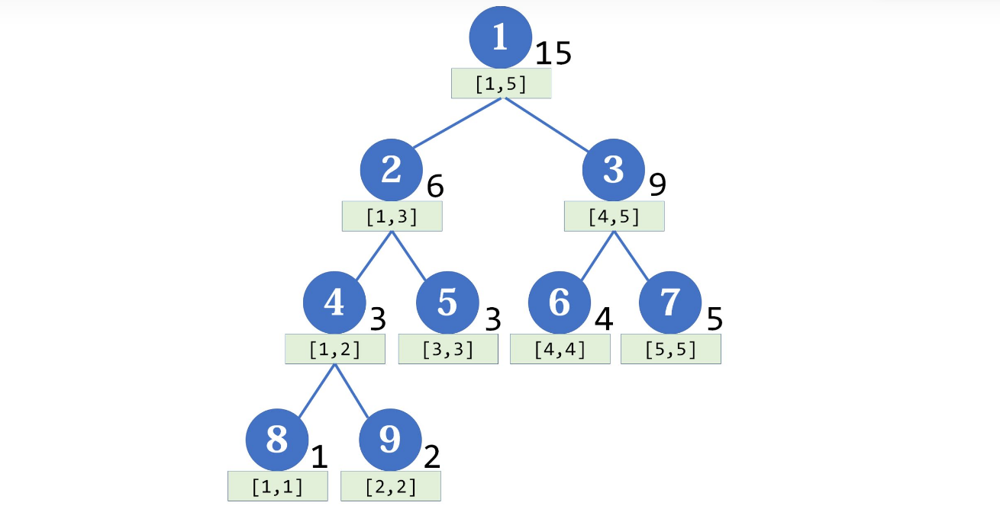
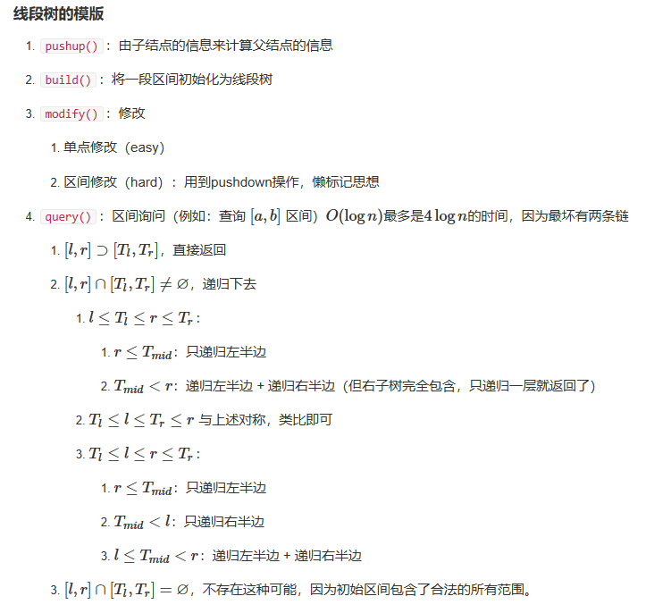

# 线段树

**线段树**（Segment Tree）几乎是算法竞赛最常用的数据结构了，它主要用于维护**区间信息**（要求满足结合律）。与树状数组相比，它可以实现` O(log⁡n) `的**区间修改**，还可以同时支持**多种操作**（加、乘），更具通用性。

线段树又称区间树，是一种基于分治思想的二叉树结构，每个节点代表一段区间，和按照利用二进制性质划分区间的树状数组相比，线段树是一种更加通用的数据结构。



**线段树维护区间和**

如题，已知一个数列，你需要进行下面两种操作：
1.将某区间每一个数加上x
2.求出某区间每一个数的和

**输入格式**

第一行包含两个整数N、M，分别表示该数列数字的个数和操作的总个数。
第二行包含N个用空格分隔的整数，其中第i个数字表示数列第i项的初始值。
接下来M行每行包含3或4个整数，表示一个操作，具体如下：
操作1： 格式：1 x y k 含义：将区间[x,y]内每个数加上k
操作2： 格式：2 x y 含义：输出区间[x,y]内每个数的和

**输出格式**

输出包含若干行整数，即为所有操作2的结果。

## 创建线段树

线段树是一棵**平衡二叉树**。母结点代表整个区间的和，越往下区间越小。注意，线段树的每个**节点**都对应一条**线段（区间）**，但并不保证所有的线段（区间）都是线段树的节点，这两者应当区分开。

每个节点p的左右节点的编号是2\*p 和 2\*p+1，假如p储存的是[a,b]的和，设`mid=⌊(l+r)/2⌋` ,那么两个子节点分别储存的是`[l,mid]`和`[mid+1,r]`的值，可以发现左节点对应的区间长度和右节点相同或者比右节点的区间长度大1。

**递归建立线段树**

```cpp
void build(ll l = 1, ll r = n, ll p = 1)
    //l：左边界  r：有边界   //p：树节点的标号
{
    if (l == r) // 到达叶子节点
        tree[p] = A[l]; // 用数组中的数据赋值
    else
    {
        ll mid = (l + r) / 2;
        build(l, mid, p * 2); // 先建立左右子节点
        build(mid + 1, r, p * 2 + 1);
        tree[p] = tree[p * 2] + tree[p * 2 + 1]; // 该节点的值等于左右子节点之和
    }
}
```

## 区间查询，单点修改



```c++
#include<iostream>
#include<cstring>
#include<algorithm>

using namespace std;

const int N=2e5+10;

typedef long long LL;

int m,p;

struct Node{

    int l,r;
    int v;  //区间[l,r]的最大值

}tr[N * 4];

void pushup(int u){ //由子节点的信息，来计算父节点的信息
    // u 节点编号
    tr[u].v=max(tr[u << 1].v,tr[u << 1 | 1].v);
}

void build(int u,int l,int r){
    // 递归建立线段树
    tr[u] = {l, r};
    if (l == r) return;
    int mid = l + r >> 1;
    build(u << 1, l, mid);
    build(u << 1 | 1, mid + 1, r);
}

int query(int u,int l,int r){
    if(tr[u].l>=l && tr[u].r<=r)
        return tr[u].v;

    int mid=tr[u].l+tr[u].r>>1;
    int v=0;
    if (l <= mid) v = query(u << 1, l, r);
    if (r > mid) v = max(v, query(u << 1 | 1, l, r));

    return v;
}

void modify(int u,int x,int v){

    //将x的值，改成v
    if (tr[u].l == x && tr[u].r == x) tr[u].v = v;

    else
    {
        int mid = tr[u].l + tr[u].r >> 1;
        if (x <= mid) modify(u << 1, x, v);
        else modify(u << 1 | 1, x, v);
        pushup(u);
    }    

}

int main(){
    int n = 0, last = 0;
    scanf("%d%d", &m, &p);
    build(1, 1, m);

    int x;
    char op[2];
    while (m -- )
    {
        scanf("%s%d", op, &x);
        if (*op == 'Q')
        {
            last = query(1, n - x + 1, n);
            printf("%d\n", last);
        }
        else
        {
            modify(1, n + 1, ((LL)last + x) % p);
            n ++ ;
        }
    }
    return 0;
}
```

## 区间修改，区间查询

### 区间修改

区间修改：引入“懒标记”（或延迟标记）的概念。懒标记是线段树的精髓所在。对于区间修改，朴素的想法是用**递归**的方式一层层修改（类似于线段树的建立），但这样的时间复杂度比较高。使用懒标记后，对于那些正好是线段树节点的区间，我们不继续递归下去，而是打上一个**标记**，将来要用到它的**子区间**的时候，再向下**传递**。

```cpp
void update(ll l, ll r, ll d, ll p = 1, ll cl = 1, ll cr = n)
    //l到r区间的节点+d  ，cl，cr当前区间   p是当前节点
{
    if (cl > r || cr < l) // 区间无交集
        return; // 剪枝
    else if (cl >= l && cr <= r) // 当前节点对应的区间包含在目标区间中
    {
        tree[p] += (cr - cl + 1) * d; // 更新当前区间的值
        if (cr > cl) // 如果不是叶子节点
            mark[p] += d; // 给当前区间打上标记
    }
    else // 与目标区间有交集，但不包含于其中
    {
        ll mid = (cl + cr) / 2;
        mark[p * 2] += mark[p]; // 标记向下传递
        mark[p * 2 + 1] += mark[p];
        
        tree[p * 2] += mark[p] * (mid - cl + 1); // 往下更新一层
        tree[p * 2 + 1] += mark[p] * (cr - mid);
        
        mark[p] = 0; // 清除标记
        
        update(l, r, d, p * 2, cl, mid); // 递归地往下寻找
        update(l, r, d, p * 2 + 1, mid + 1, cr);
        tree[p] = tree[p * 2] + tree[p * 2 + 1]; // 根据子节点更新当前节点的值
    }
}
```

更新时，我们是从最大的区间开始，递归向下处理。注意到，**任何区间都是线段树上某些节点的并集**。于是我们记目标区间为` [l,r]` ，当前区间为` [cl,cr]`， 当前节点为 p ，我们会遇到三种情况：

1. 当前区间与目标区间没有交集：这时直接结束递归。

2. 当前区间被包括在目标区间里：这时可以更新当前区间，别忘了乘上区间长度：

   ```cpp
   tree[p] += (cr - cl + 1) * d;
   ```

   然后打上懒标记（叶子节点可以不打标记，因为不会再向下传递了）：

   ```cpp
    mark[p] += d;
   ```

   这个标记表示“该区间上每一个点都要加上d”。因为原来可能存在标记，所以是+=而不是=。
   
3. 当前区间与目标区间相交，但不包含于其中：
   
   这时把当前区间一分为二，分别进行处理。如果存在懒标记，要先把懒标记传递给子节点（注意也是+=，因为原来可能存在懒标记）：
   
   ```cpp
   ll mid = (cl + cr) / 2;
   mark[p * 2] += mark[p];
   mark[p * 2 + 1] += mark[p];
   ```
   
   两个子节点的值也就需要相应的更新（后面乘的是区间长度）：
   
   ```cpp
   tree[p * 2] += mark[p] * (mid - cl + 1);
   tree[p * 2 + 1] += mark[p] * (cr - mid);
   ```
   
   不要忘记清除该节点的懒标记：
   
   ```cpp
   mark[p] = 0;
   ```
   
   这个过程并不是递归的，我们只往下传递一层（所以叫“懒”标记啊！），以后要用再才继续传递。其实我们常常把这个传递过程封装成一个函数：
   
   ```cpp
   inline void push_down(ll p, ll len)
   {
       mark[p * 2] += mark[p];
       mark[p * 2 + 1] += mark[p];
       tree[p * 2] += mark[p] * (len - len / 2);
       tree[p * 2 + 1] += mark[p] * (len / 2); // 右边的区间可能要短一点
       mark[p] = 0;
   }
   ```
   
   然后在update函数中这样调用：
   
   ```cpp
   push_down(p, cr - cl + 1);
   ```
   
   传递完标记后，再递归地去处理左右两个子节点。

至于**单点修改**，只需要**令左右端点相等即可**。

### 区间查询

有了区间修改的经验，区间查询的方法完全类似，直接上代码了：

```cpp
ll query(ll l, ll r, ll p = 1, ll cl = 1, ll cr = n)
{
    if (cl > r || cr < l)
        return 0;
    else if (cl >= l && cr <= r)
        return tree[p];
    else
    {
        ll mid = (cl + cr) / 2;
        push_down(p, cr - cl + 1);
        return query(l, r, p * 2, cl, mid) + query(l, r, p * 2 + 1, mid + 1, cr); 
        // 上一行拆成三行写就和区间修改格式一致了
    }
}

```

一样的递归，一样自顶至底地寻找，一样的合并信息。

## 汇总代码

```cpp
#include <bits/stdc++.h>
using namespace std;
using ll = long long;
const int MAXN = 1e5 + 5;
ll tree[MAXN << 2], mark[MAXN << 2], n, m, A[MAXN];
void push_down(int p, int len)
{
    if (len <= 1) return;
    tree[p << 1] += mark[p] * (len - len / 2);
    mark[p << 1] += mark[p];
    tree[p << 1 | 1] += mark[p] * (len / 2);
    mark[p << 1 | 1] += mark[p];
    mark[p] = 0;
}
void build(int p = 1, int cl = 1, int cr = n)
{
    if (cl == cr) return void(tree[p] = A[cl]);
    int mid = (cl + cr) >> 1;
    build(p << 1, cl, mid);
    build(p << 1 | 1, mid + 1, cr);
    tree[p] = tree[p << 1] + tree[p << 1 | 1];
}
ll query(int l, int r, int p = 1, int cl = 1, int cr = n)
{
    if (cl >= l && cr <= r) return tree[p];
    push_down(p, cr - cl + 1);
    ll mid = (cl + cr) >> 1, ans = 0;
    if (mid >= l) ans += query(l, r, p << 1, cl, mid);
    if (mid < r) ans += query(l, r, p << 1 | 1, mid + 1, cr);
    return ans;
}
void update(int l, int r, int d, int p = 1, int cl = 1, int cr = n)
{
    if (cl >= l && cr <= r) return void(tree[p] += d * (cr - cl + 1), mark[p] += d);
    push_down(p, cr - cl + 1);
    int mid = (cl + cr) >> 1;
    if (mid >= l) update(l, r, d, p << 1, cl, mid);
    if (mid < r) update(l, r, d, p << 1 | 1, mid + 1, cr);
    tree[p] = tree[p << 1] + tree[p << 1 | 1];
}
int main()
{
    ios::sync_with_stdio(false);
    cin >> n >> m;
    for (int i = 1; i <= n; ++i)
        cin >> A[i];
    build();
    while (m--)
    {
        int o, l, r, d;
        cin >> o >> l >> r;
        if (o == 1)
            cin >> d, update(l, r, d);
        else
            cout << query(l, r) << '\n';
    }
    return 0;
}
```
