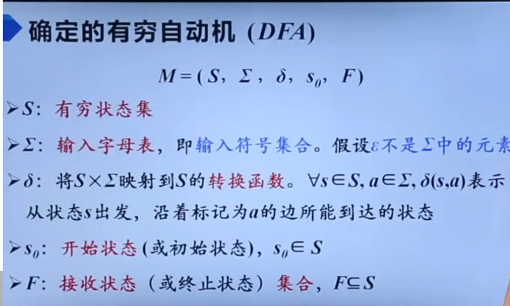

# 有穷状态机（DFA、NFA）和有限状态机

## 1. 有穷状态机 vs. 有限状态机
- **有穷状态机**（Deterministic Finite Automaton, DFA 或 Non-deterministic Finite Automaton, NFA）：
  - 强调状态数是有限的，并且在**形式语言**和**自动机理论**中经常使用这种叫法。
  - 常见于**计算机科学理论、形式语言、编译原理**中。
- **有限状态机**（Finite State Machine, FSM）：
  - 更广泛的概念，通常用在**工程、控制系统、硬件电路设计**中，强调状态的有限性，但不一定和形式语言直接相关。

**总结**：本质上两者没有区别，只是领域和应用场景不同。

---

## 2. DFA 和 NFA 的区别

### DFA（确定性有穷状态机, Deterministic Finite Automaton）  
- **状态转移确定**：在任一状态下，对任一输入符号，都有且仅有一个确定的转移状态。  
- **形式定义**：  
  $$
  M = (Q, Σ, δ, q_0, F)
  $$
  - $Q$：状态集合
  - $Σ$：输入符号集合
  - $δ$：状态转移函数 $δ: Q \times Σ \to Q$
  - $q_0$：初始状态
  - $F$：接受状态集合
- **特点**：
  - **没有 $ε$ 转移**（空字符串转移）。  
  - **运行路径唯一**：每个输入串都有唯一的运行路径。

---

### NFA（非确定性有穷状态机, Non-deterministic Finite Automaton）  
- **状态转移不确定**：在某一状态下，对某一输入符号，可以有多个转移状态，甚至可以没有转移状态。  
- **形式定义**：  
  $$
  M = (Q, Σ, δ, q_0, F)
  $$
  - $Q$：状态集合
  - $Σ$：输入符号集合
  - $δ$：状态转移函数 $δ: Q \times (Σ \cup \{ε\}) \to 2^Q$
  - $q_0$：初始状态
  - $F$：接受状态集合
- **特点**：
  - **可以有 $ε$ 转移**，即可以不消耗输入就改变状态。  
  - **运行路径不唯一**：对某个输入串，可能有多条运行路径。

---

## 3. DFA 和 NFA 的关系
- **等价性**：NFA 和 DFA 在**表达能力**上是等价的，都能识别相同的正则语言（即正则语言类）。  
- **转化**：每个 NFA 都可以通过**子集构造法**转化为等价的 DFA。  
- **效率**：  
  - DFA 的状态转移时间复杂度为 $O(1)$，因为状态转移是确定的。
  - NFA 的状态转移时间复杂度较高，最坏情况下为**指数级**，因为需要同时追踪多个状态。

---

## 总结
- **有穷状态机** 和 **有限状态机** 本质一样，只是叫法不同。  
- **DFA 和 NFA** 都是有穷状态机：
  - DFA 状态转移确定，NFA 状态转移不确定且可能有 $ε$ 转移。  
  - DFA 更高效，但可能需要更多状态；NFA 更简洁，但实现复杂。  
  - NFA 可以转化为等价的 DFA。

