# 计算机组成原理

**ALU是运算器，CU是控制器**

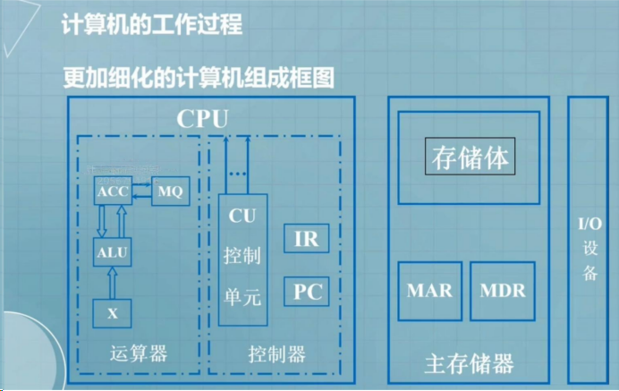

"MDR" 和 "MAR" 是计算机体系结构中常见的两个寄存器：

1. **MDR (Memory Data Register)**：内存数据寄存器，用于暂时存储从内存中读取或要写入内存的数据。当 CPU 需要从内存中读取数据时，数据会被加载到 MDR 中。同样地，当 CPU 需要将数据写入内存时，数据会首先被放置到 MDR 中，然后再写入内存。MDR 是 CPU 和主存（内存）之间数据传输的一个关键部分。

2. **MAR (Memory Address Register)**：内存地址寄存器，用于存储 CPU 正在访问的内存单元的地址。当 CPU 需要读取或写入内存中的数据时，它首先将要访问的内存地址加载到 MAR 中。MAR 提供了访问内存中特定位置的能力，它将指示内存中的某个位置。

这两个寄存器在 CPU 的指令执行周期中起着重要作用。MAR 用于确定需要读取或写入的内存地址，而 MDR 则用于暂时存储这些数据。这些寄存器是计算机架构中基本的数据传输和控制机制的一部分。

## 1 数的表示和电路的基本原理

### 数的表示

#### 无符号整数的运算

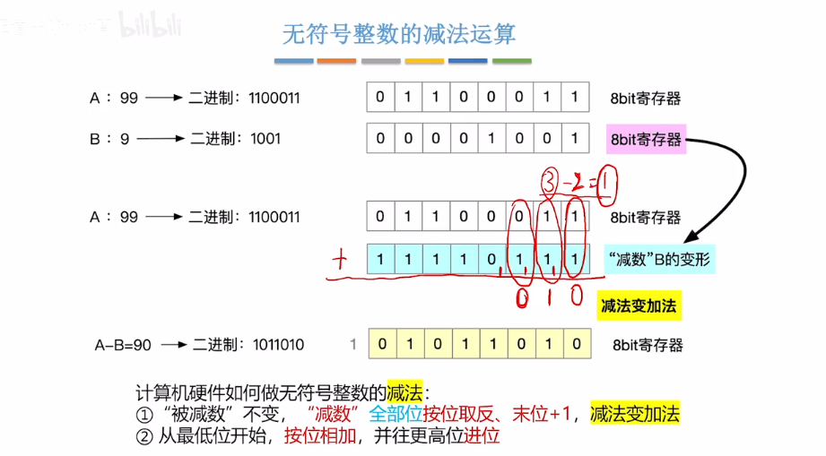

#### 带符号整数的运算

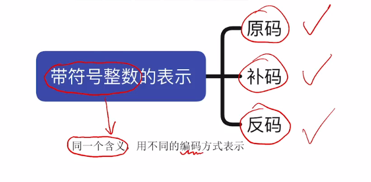

**原码表示**
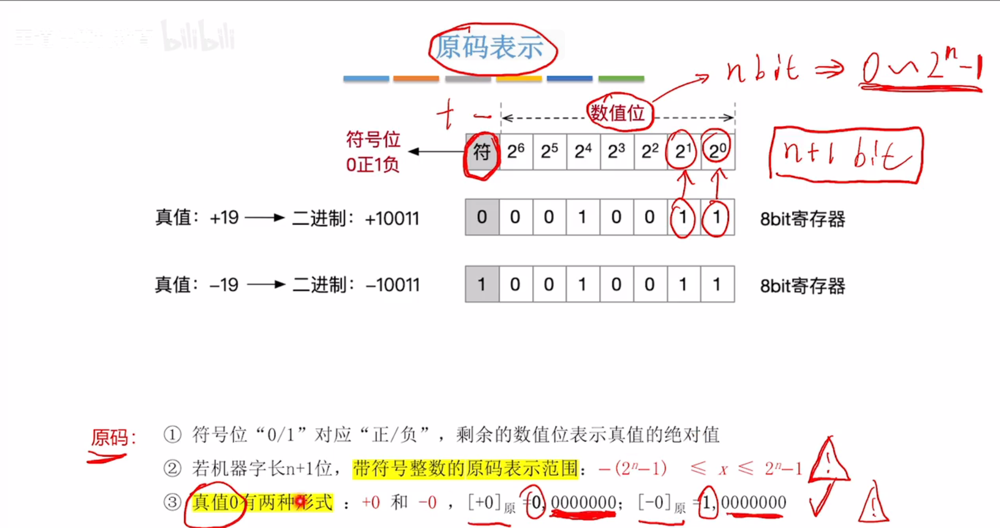

**补码表示**

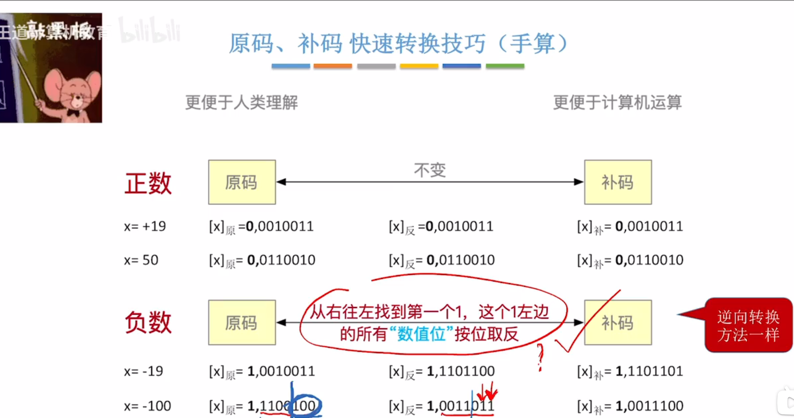

**各种码的总结**

### 电路的基本原理

 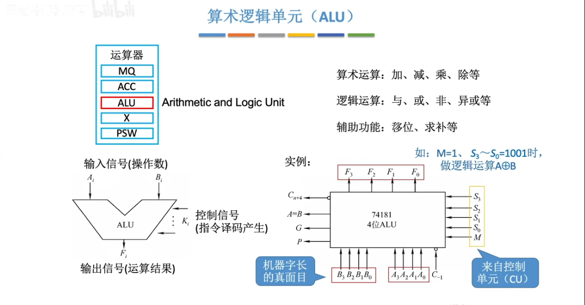

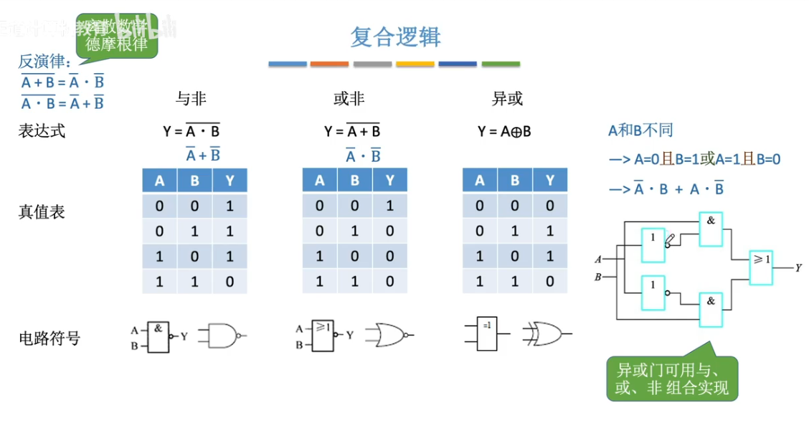

#### 串行全加器

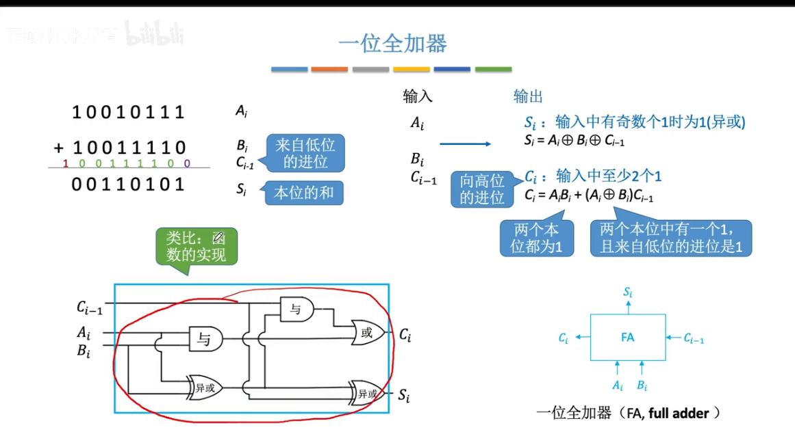

#### 并行进位加法器

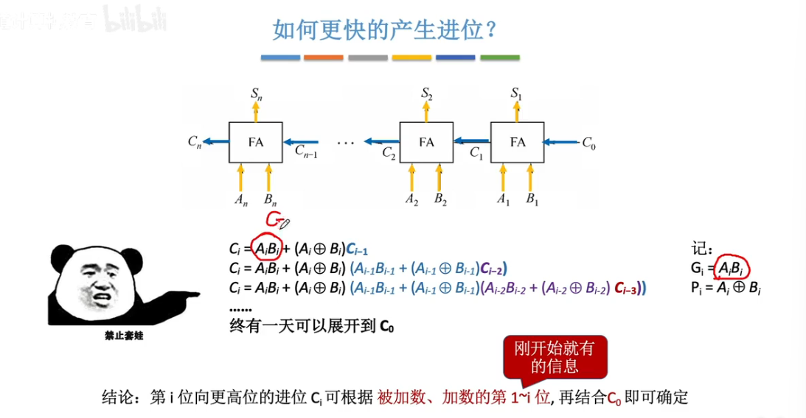

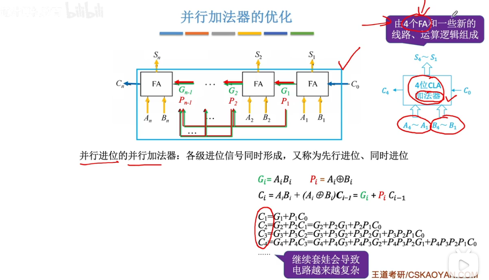

#### 补码加减运算器

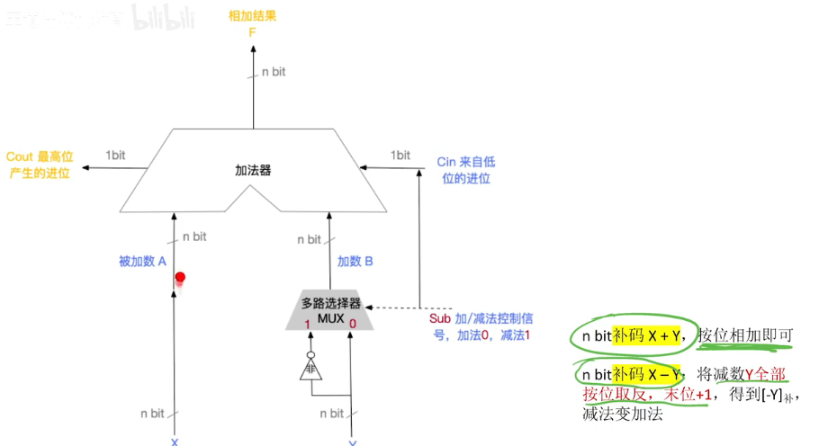

## 2 存储器

### ROM

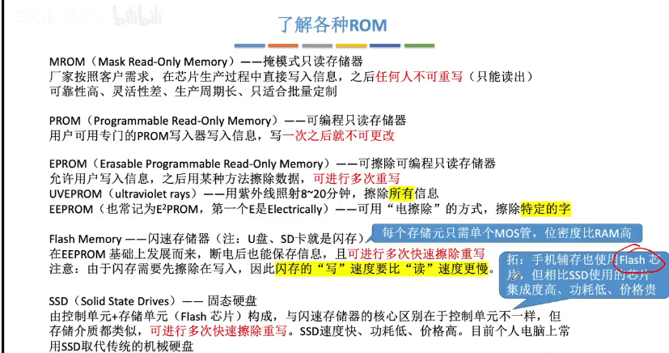

### RAM

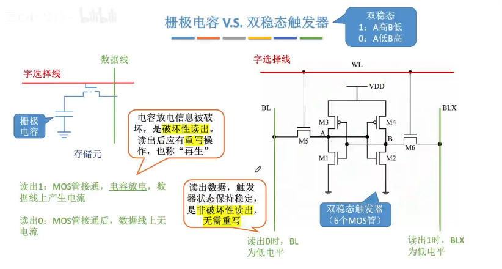

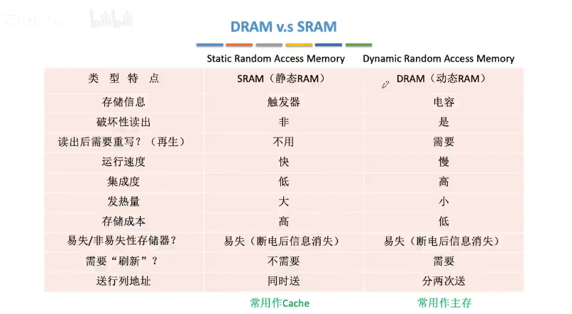

## 3 CISC和RISC

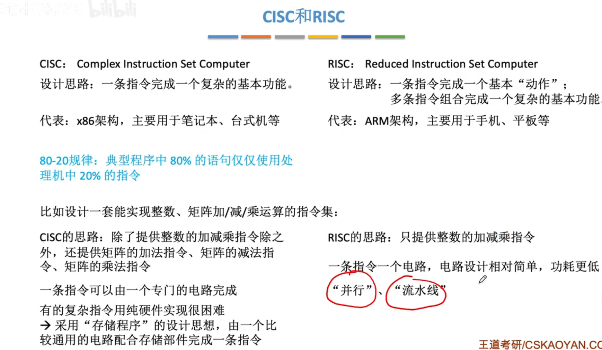

## 4 五段式流水线

在 MIPS（Microprocessor without Interlocked Pipeline Stages）架构中，五段式流水线的工作原理如下：

1. **取指（Instruction Fetch）**：在这个阶段，处理器从指令存储器中读取指令。在 MIPS 中，指令存储器的地址由程序计数器（PC）提供，指令被取出并存储在指令寄存器（Instruction Register）中。

2. **译码（Instruction Decode）**：在这个阶段，处理器解码已经取出的指令，并确定该指令的操作类型以及操作数。在 MIPS 中，指令译码阶段的主要任务是将指令字段解析为操作码（opcode）以及可能的操作数，这些操作数存储在寄存器文件中。

3. **执行（Execute）**：在执行阶段，根据译码阶段得到的操作类型和操作数执行指令。对于算术指令，这可能涉及对寄存器中的数据进行算术或逻辑运算。对于分支指令，执行阶段还会计算分支条件并决定下一步执行的指令地址。

4. **访存（Memory Access）**：在 MIPS 中，访存阶段用于对内存进行读取或写入操作。这个阶段通常在执行加载（load）或存储（store）指令时发挥作用，例如加载数据到寄存器或将数据从寄存器写入内存。

5. **写回（Write Back）**：在写回阶段，处理器将执行阶段产生的结果写回到寄存器文件中。这意味着，如果执行阶段产生了某些计算结果，这些结果将被写入到目标寄存器中。对于大多数指令来说，写回阶段是最后一个阶段。

这就是 MIPS 架构中五段式流水线的工作原理。它通过并行地执行不同阶段的指令来提高处理器的效率和性能。

## 5 外部IO控制

## 6 指令格式

### 计算机的工作过程

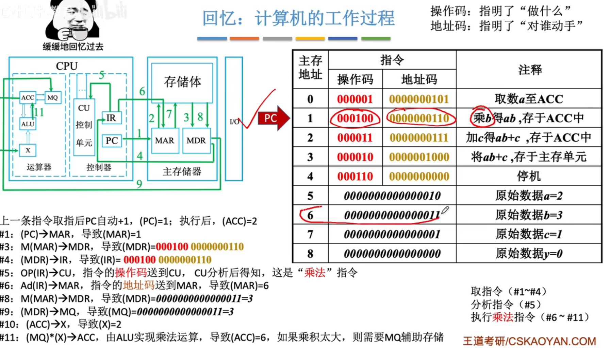

### 指令

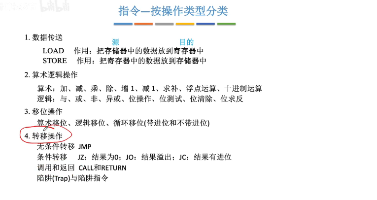

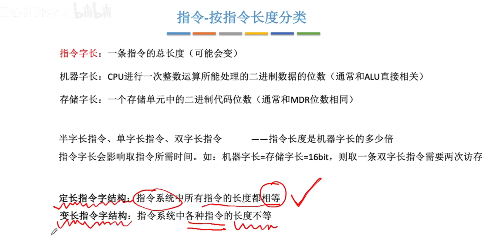

#### 零地址指令

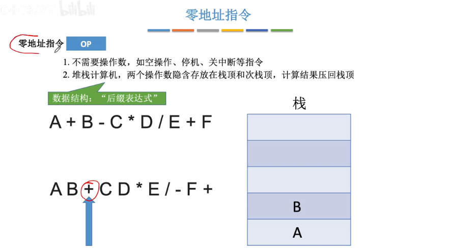

#### 一地址指令

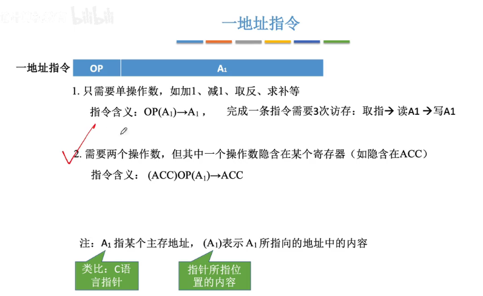

#### 二三地址指令

#### 四地址指令

