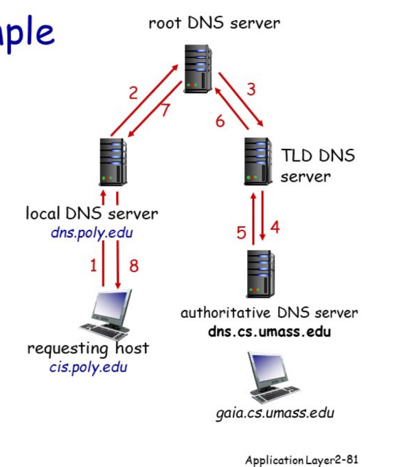
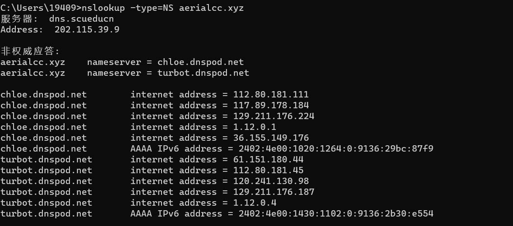

# DNS server



## Local DNS Sever

Local DNS服务器（Domain Name System）通常是指部署在本地网络中的DNS服务器。它的作用是为本地网络中的设备提供DNS解析服务，将主机名转换成IP地址。

当一个设备（如电脑、手机、路由器等）需要连接到互联网上的某个服务时，它会向本地DNS服务器发送一个DNS查询请求，请求该服务的IP地址。如果本地DNS服务器已经缓存了该服务的IP地址，则直接返回给设备。否则，本地DNS服务器会向其他DNS服务器发出查询请求，以获取该服务的IP地址，并把获取到的结果缓存到本地，以便下次快速响应。

通过部署本地DNS服务器，可以提高DNS解析的速度和可靠性，同时还可以减少网络带宽的消耗，因为本地DNS服务器会缓存已经查询过的域名对应的IP地址，减少了向外发送查询请求的次数。

### 查看local dns server

在 Windows 操作系统中，可以通过以下步骤查看本地 DNS 服务器地址：

1. 打开控制面板：可以通过开始菜单或者任务栏搜索栏中输入“控制面板”来打开。
2. 选择“网络和共享中心”：在控制面板中，选择“网络和共享中心”选项。
3. 查看连接的网络：在“网络和共享中心”页面中，可以看到计算机连接的网络，如“本地连接”或“Wi-Fi”。
4. 查看网络属性：点击连接的网络，进入该网络的状态页面，然后点击“属性”按钮。
5. 查看 DNS 服务器地址：在“本地连接属性”或“Wi-Fi属性”页面中，可以看到“Internet 协议版本 4(TCP/IPv4)”和“Internet 协议版本 6(TCP/IPv6)”两个选项。选择“Internet 协议版本 4(TCP/IPv4)”选项，然后点击“属性”按钮，在弹出的窗口中，可以看到本地 DNS 服务器的 IP 地址。

## Authoritative DNS Server

授权域名服务器（Authoritative Name Server）是负责管理特定域名的DNS记录的DNS服务器。当用户向本地DNS服务器发出针对某个域名的DNS查询请求时，本地DNS服务器将向该域名的授权域名服务器发出查询请求，以获取该域名的DNS记录。

授权域名服务器负责维护该域名的DNS记录，包括A记录、MX记录、CNAME记录等。当授权域名服务器收到来自本地DNS服务器的DNS查询请求时，它会查询自己的DNS记录，查找该域名对应的IP地址或其他DNS记录，并将查询结果返回给本地DNS服务器。

授权域名服务器的性能和可靠性对于域名解析的速度和成功率非常重要。如果授权域名服务器无法正常工作，用户将无法访问该域名下的网站或使用该域名的电子邮件服务等。因此，域名所有者或管理员通常会选择可靠的DNS解析服务提供商来管理他们的授权域名服务器，以确保DNS解析服务的稳定性和可靠性。

### 查看授权域名服务器

要查看服务器的授权 DNS 服务器（Authoritative DNS Server），可以使用命令行工具进行查询。具体步骤如下：

1. 打开命令提示符：在 Windows 操作系统中，可以按下“Win+R”组合键，打开“运行”窗口，然后输入“cmd”并按下“Enter”键即可打开命令提示符。在 macOS 或 Linux 操作系统中，可以打开终端应用程序。
2. 使用 nslookup 命令查询：在命令提示符或终端中，使用 nslookup 命令进行查询。例如，要查询域名为“example.com”的授权 DNS 服务器，可以输入以下命令：

```
nslookup -type=NS example.com
```

这条命令将返回域名为“example.com”的 NS 记录，其中包含授权 DNS 服务器的域名和 IP 地址。



打开腾讯云**我的域名**发现，aerialcc.xyz这个域名的DNS解析的DNS服务器正是授权域名服务器。


## NS记录

NS记录（Name Server记录）是一种DNS记录类型，用于指定管理特定域名的授权域名服务器。当用户向本地DNS服务器发出对特定域名的DNS查询请求时，本地DNS服务器会查询该域名的NS记录，以查找授权域名服务器的IP地址，并向授权域名服务器发出进一步的查询请求，以获取该域名的DNS记录。

**NS记录通常由域名的注册商或DNS服务提供商进行管理**。域名所有者可以通过修改NS记录来指定他们选择的DNS服务提供商为他们的授权域名服务器。通常，每个域名至少需要指定两个NS记录，以提高域名解析的可靠性和容错性。

例如，假设一个域名的NS记录指定了两个授权域名服务器，分别是ns1.example.com和ns2.example.com。当用户向本地DNS服务器发出对该域名的DNS查询请求时，本地DNS服务器将查找该域名的NS记录，发现授权域名服务器分别是ns1.example.com和ns2.example.com。然后，本地DNS服务器将向ns1.example.com和ns2.example.com发出DNS查询请求，以获取该域名的DNS记录。如果ns1.example.com无法响应，本地DNS服务器将向ns2.example.com发出进一步的查询请求，以保证域名解析的可靠性和容错性。

## MX记录

MX记录（Mail Exchange记录）是一种DNS记录类型，用于指定处理特定域名的电子邮件流量的邮件交换服务器。当用户向特定域名的电子邮件地址发送电子邮件时，邮件将通过MX记录中指定的邮件交换服务器路由到该域名的邮件服务器。

MX记录通常由域名的管理员或DNS服务提供商进行管理。MX记录可以包含多个邮件交换服务器，按优先级排序，以便在主要邮件服务器不可用时自动转到备用邮件服务器。

例如，假设一个域名的MX记录指定了两个邮件交换服务器，分别是mail1.example.com和mail2.example.com。当用户向该域名的电子邮件地址发送电子邮件时，他们的邮件客户端将通过MX记录中指定的邮件交换服务器路由到该域名的邮件服务器。如果mail1.example.com无法响应，则邮件将自动转到mail2.example.com。这样可以确保该域名的电子邮件服务的稳定性和可靠性。

**以下是qq.com的MX记录：**

```
qq.com MX 5 mx1.qq.com
qq.com MX 10 mx2.qq.com
qq.com MX 15 mx3.qq.com
qq.com MX 20 mx4.qq.com
```

这里列出了四个MX记录，优先级从5到20不等。当有人向qq.com的电子邮件地址发送邮件时，邮件将首先通过优先级最高的MX记录路由到mx1.qq.com，如果mx1.qq.com不可用，则自动转到下一个优先级较低的MX记录，直到找到一个可用的邮件交换服务器。
