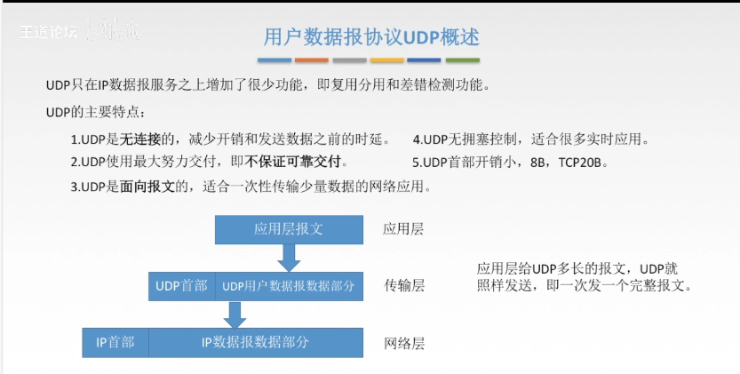
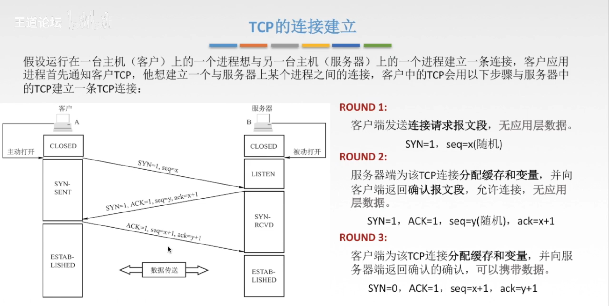
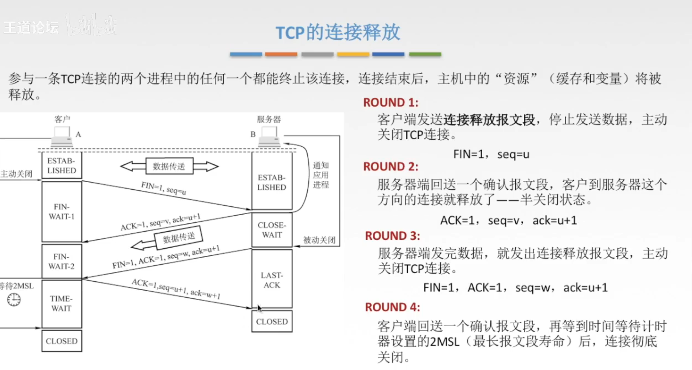
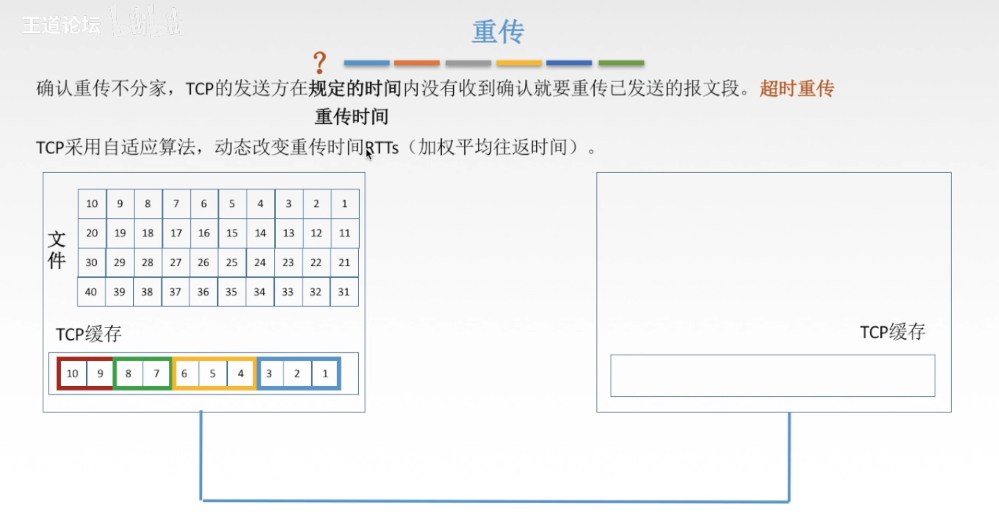
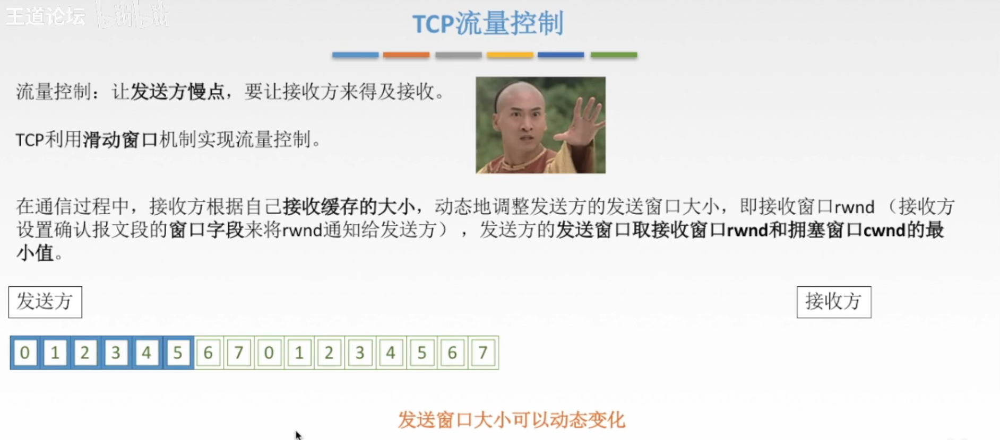
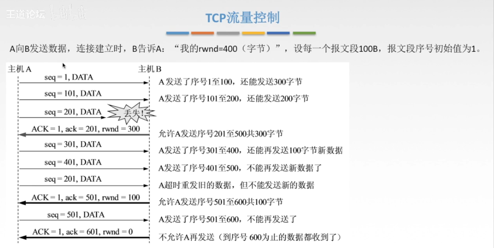
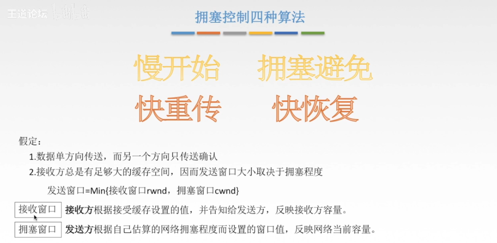
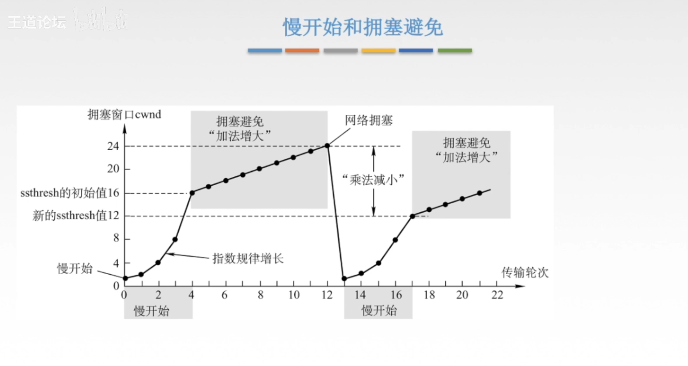
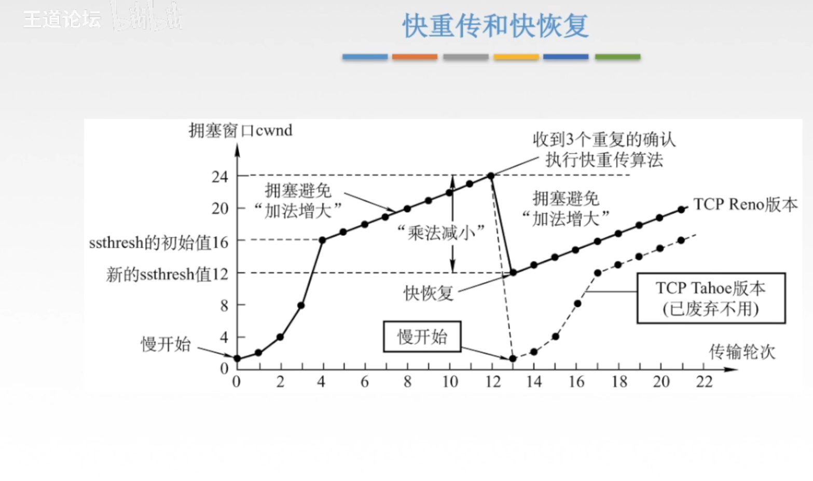

# 传输层协议

## UDP协议

## TCP协议

### TCP连接管理

#### 三次握手

三次握手（Three-way Handshake）是TCP/IP协议族中建立TCP连接的过程，用于确保客户端和服务器之间的通信能够正常进行。该过程包括以下三个步骤：

1. **客户端向服务器发送请求（SYN）：** 客户端首先向服务器发送一个带有SYN标志的数据包，表示客户端请求建立连接，并选择一个初始的序列号（Sequence Number）。

2. **服务器确认请求（SYN+ACK）：** 服务器收到客户端的SYN请求后，如果同意建立连接，则会发送一个带有SYN和ACK标志的数据包作为确认，同时也选择一个初始的序列号。

3. **客户端确认服务器的确认（ACK）：** 最后，客户端收到服务器的确认后，会向服务器发送一个带有ACK标志的数据包，表示客户端也确认了连接的建立。

完成这三个步骤后，TCP连接就建立起来了，客户端和服务器之间可以开始进行数据的传输。这种三次握手的过程可以确保双方都能够正常地接收和发送数据，并且能够同步彼此的序列号，以保证数据的可靠传输。

#### 四次挥手

四次挥手（Four-way Handshake）是TCP/IP协议中用于关闭一个已经建立的连接的过程。与建立连接时的三次握手相比，关闭连接需要四个步骤，这样可以确保双方都能够正确地关闭连接并释放资源。四次挥手的过程如下：

1. **客户端发起关闭请求：** 客户端发送一个带有FIN（Finish）标志的数据包给服务器，表示客户端不再发送数据，但仍然可以接收数据。

2. **服务器确认关闭请求：** 服务器收到客户端的FIN后，会发送一个带有ACK标志的数据包给客户端，表示确认收到关闭请求。

3. **服务器发送关闭请求：** 服务器也会向客户端发送一个带有FIN标志的数据包，表示服务器也准备关闭连接。

4. **客户端确认关闭请求：** 客户端收到服务器的FIN后，会发送一个带有ACK标志的数据包给服务器，表示确认收到服务器的关闭请求。

完成这四个步骤后，连接就被彻底关闭了。需要注意的是，关闭连接的过程中，客户端和服务器都可以继续发送数据，直到双方都发送了关闭请求并确认后，连接才算真正关闭。这种四次挥手的过程可以确保双方都能够正确地关闭连接，并且不会出现数据丢失或者连接资源无法释放的问题。

### TCP可靠传输(累计确认和超时重传)

累积确认（Cumulative Acknowledgment）和超时重传（Timeout Retransmission）是TCP协议中用于确保数据可靠传输的两个重要机制。

1. **累积确认（Cumulative Acknowledgment）：** 在TCP连接中，接收方会向发送方发送确认（acknowledgment）报文，以指示已经成功接收到的数据段。累积确认表示接收方确认已经收到的连续数据段的最后一个序号，而不是每个数据段单独进行确认。例如，如果接收方已经成功接收了数据段1到5，但由于某种原因未收到数据段6，那么它将向发送方发送一个确认序号为6的确认报文，表示已经成功接收到序号小于6的所有数据段。

2. **超时重传（Timeout Retransmission）：** 超时重传是指发送方在一定时间内未收到接收方的确认时，会认为数据丢失，并立即重新发送未确认的数据段。发送方会维护一个定时器，当定时器超时时，会触发重传机制，重新发送未收到确认的数据段。超时时间通常由网络延迟和拥塞情况动态调整，以确保适应不同的网络环境。

这两个机制共同确保了TCP连接的可靠性。累积确认提供了一种高效的方式来确认接收到的数据段，减少了确认报文的数量，从而降低了网络负载。而超时重传则是作为一种保险机制，用于应对网络丢包等异常情况，确保数据能够在合理的时间内被正确传输。通过这两个机制的配合，TCP协议能够在不可靠的网络环境下实现可靠的数据传输。

### TCP流量控制

### TCP拥塞控制

快速重传（Fast Retransmit）和快速恢复（Fast Recovery）是TCP协议中的两种机制，用于在发生丢包时加快恢复速度，提高网络传输的效率。

1. **快速重传（Fast Retransmit）：** 当发送方在一定时间内没有收到对特定数据段的确认，它会认为该数据段丢失了。在这种情况下，通常的TCP行为是等待定时器超时后重传丢失的数据段。但是，快速重传允许发送方在没有等待定时器超时的情况下，如果连续收到三个重复确认（acknowledgment）的报文，就可以立即进行重传。这意味着TCP可以更快地检测到丢失的数据段，并尽早地进行重传，而不必等待定时器超时。

2. **快速恢复（Fast Recovery）：** 在快速重传之后，TCP进入快速恢复状态。在这种状态下，TCP会继续发送新的数据，但是发送速率会降低，以便控制网络的拥塞。当发送方收到缺失数据段的确认后，TCP会进入拥塞避免（Congestion Avoidance）状态。快速恢复通过维护一个拥塞窗口（congestion window）来限制发送方可以发送的数据量，从而避免造成网络拥塞。

快速重传和快速恢复的机制能够更快地应对网络拥塞和丢包情况，提高TCP连接的性能和可靠性。
