# 物理层协议

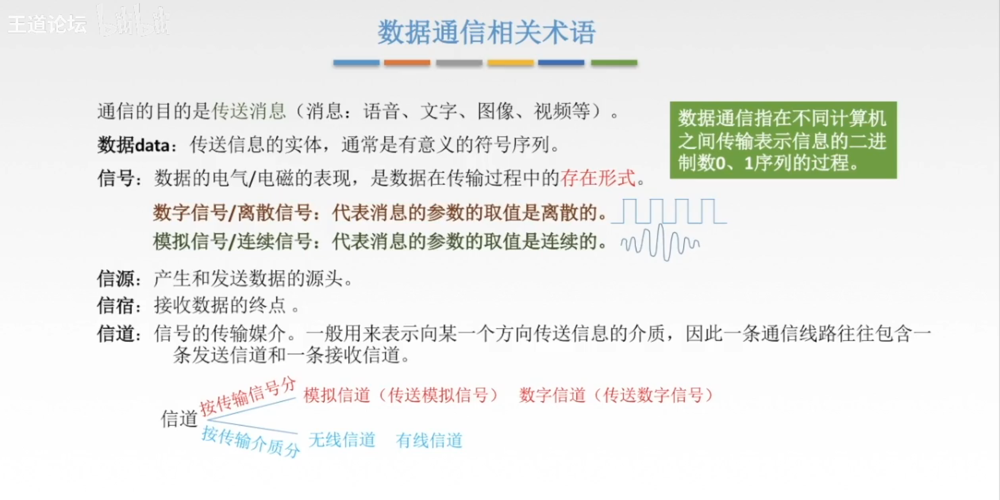

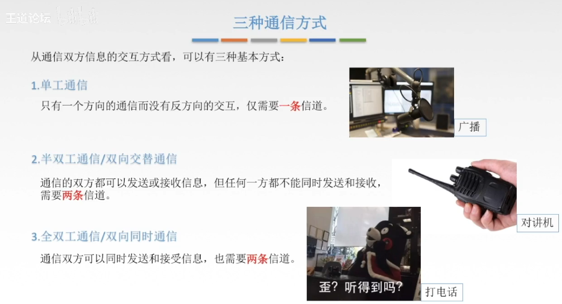

## 奈氏准则和香农定理

### 码元

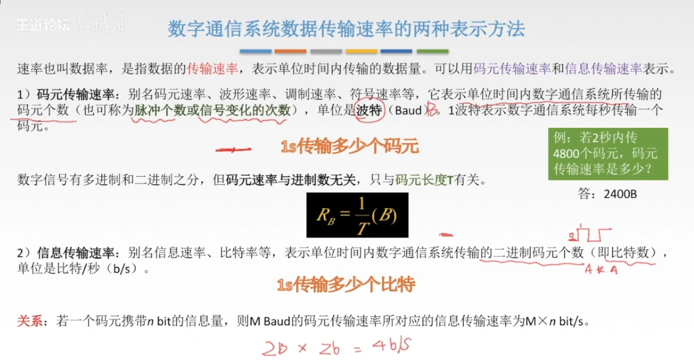

一个码元可以携带的 bit 数量取决于所使用的调制方式和信号特性。在数字通信中，常见的调制方式包括二进制调制（如二进制相移键控（BPSK））、四进制调制（如四相移键控（QPSK））、八进制调制（如八相移键控（8PSK））等。

一些常见的调制方式中，一个码元可以携带的 bit 数量如下：

1. **BPSK（二进制相移键控）：** BPSK 是一种二进制调制方式，它使用两个不同的相位来表示 0 和 1。因此，一个码元可以携带 1 bit 信息。

2. **QPSK（四相移键控）：** QPSK 是一种四进制调制方式，它将信号分为四个不同的相位来表示每个码元，每个相位代表两个 bit，因此一个码元可以携带 2 bit 信息。

3. **8PSK（八相移键控）：** 8PSK 是一种八进制调制方式，它将信号分为八个不同的相位来表示每个码元，每个相位代表三个 bit，因此一个码元可以携带 3 bit 信息。

需要注意的是，调制方式不同，每个码元所能携带的 bit 数量也不同。在实际通信中，选择适当的调制方式可以根据信道条件、带宽限制、抗干扰能力等因素进行权衡，以最大化数据传输速率和可靠性。

### 带宽

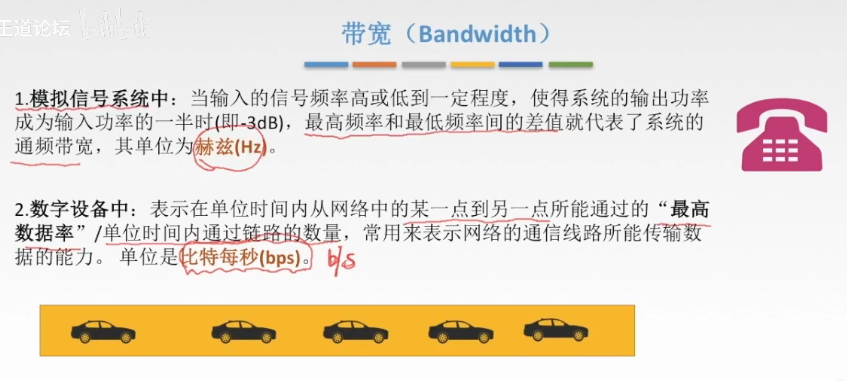

### 奈式准则和香农定理

奈奎斯特准则（Nyquist Criterion）和香农定理（Shannon's Theorem）都是与数字通信和信息传输相关的基本原理，尤其在信号处理和通信工程领域中应用广泛。

**奈奎斯特准则（Nyquist Criterion）：** 奈奎斯特准则是由美国工程师哈里·S·奈奎斯特（Harry Nyquist）在20世纪提出的一个重要概念。该准则规定了在无噪声环境下，一个连续信号必须以至少两倍于信号带宽的采样率进行采样，才能保证完美地恢复原始信号。换句话说，采样频率必须大于信号带宽的两倍，以避免采样导致的混叠（混淆）效应。这个准则在数字信号处理和通信中至关重要，确保了在采样时不丢失信号的重要信息。

**香农定理（Shannon's Theorem）：** 香农定理是由美国数学家克劳德·香农（Claude Shannon）在1948年提出的，它描述了在理想条件下，通过一个有限带宽的信道，可以以多大的速率传输信息而不产生错误。具体而言，香农定理指出，对于一个带宽为W的理想信道，其最大可靠传输速率（单位时间内可传输的最大信息量）为2W，即香农公式可以表达为：C = W * log2(1 + S/N)，其中C是信道的容量，W是信道的带宽，S是信号功率，N是噪声功率。香农定理对于理解和设计数字通信系统以及信息论有着重要意义。

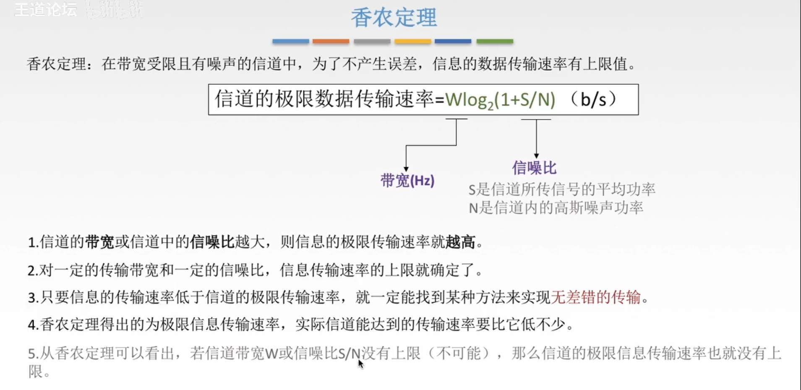

总的来说，奈奎斯特准则关注的是如何在采样时避免混叠效应，而香农定理则关注的是在信道带宽有限的情况下，如何最大化地传输信息。这两个原理共同构成了数字通信和信息理论中的基础。

## 数据通信模型

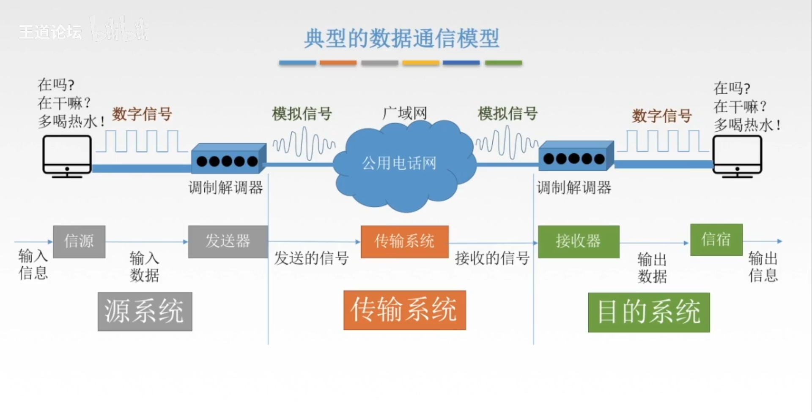

## 信息交换方式

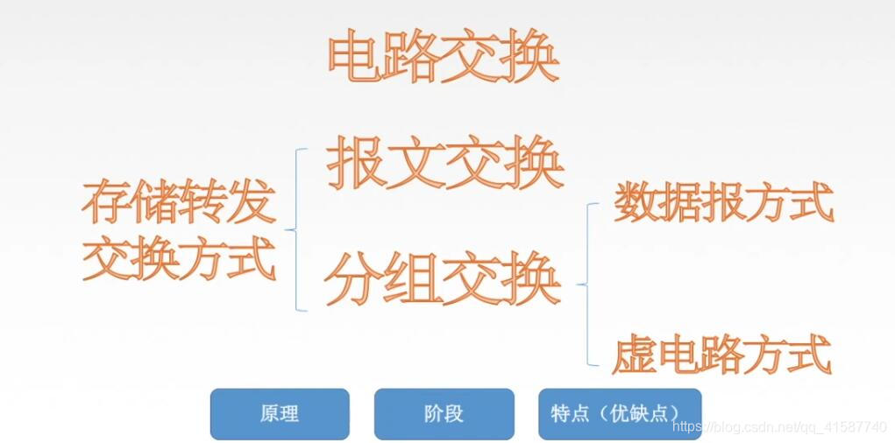

**为什么要进行数据交换：**

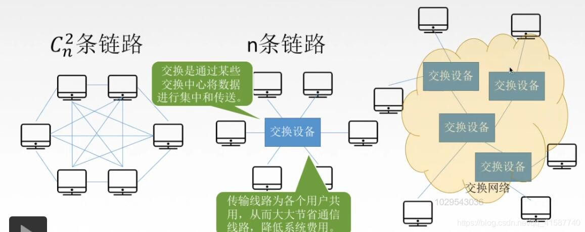

当有多台计算机要进行数据交换时，若每俩台计算机建立一条链路会耗费很大的成本；所以产生了如上图中间所示的星形拓扑结构；若计算机数量巨大时，就会产生交换网络。

### 电路交换

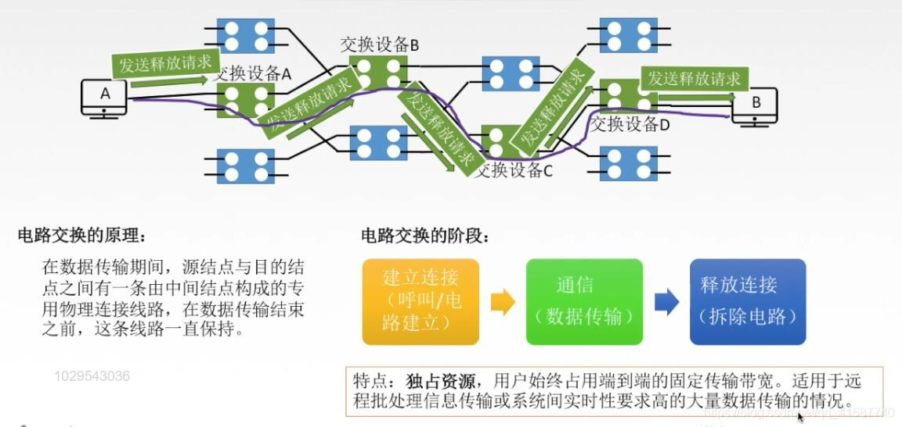

最主要的特点就是独占链路，在AB建立连接后，交换设备ABCD这条链路就无法被他人使用直到主机AB连接断开

过程：
1、A发送一个建立连接的请求，通过路由选择算法到达B，B回复给A一个应答请求，连接建立
2、双方开始传输数据
3、同过程1类似，此次发送释放连接的请求，连接断开
通俗来讲就是打电话(是电话，不是手机)的过程，先打通，对方接通；搞事情；然后挂掉

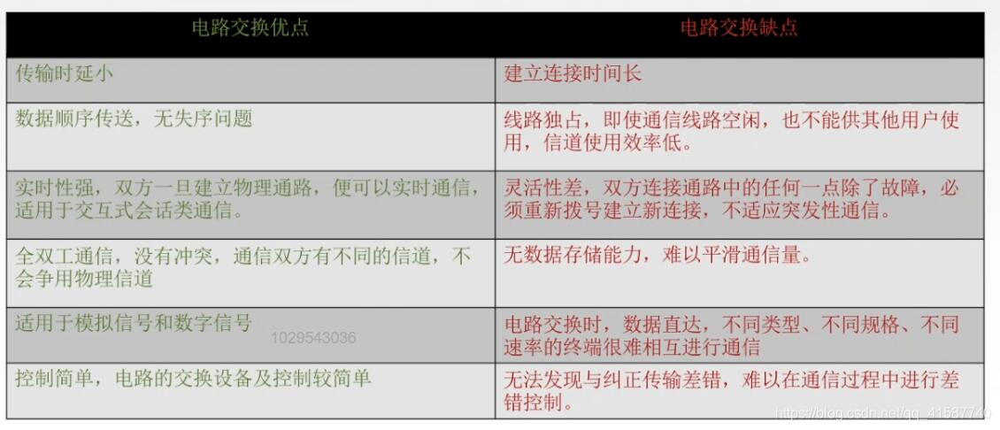

### 报文交换

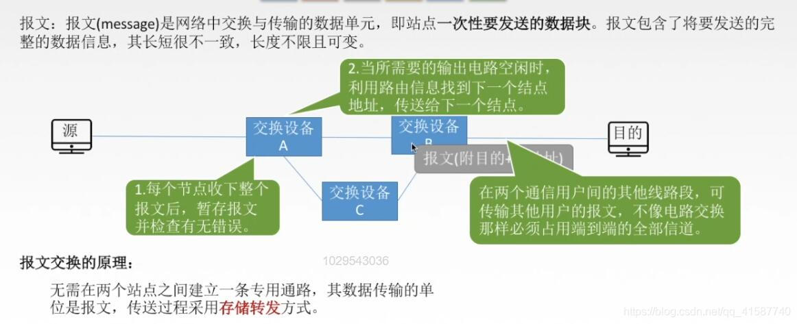

**最大的特点就是不独占链路且可以存储转发**

源给A，A发现B空闲给B，不空闲暂存；B发现目的空闲，给目的
只有传输的那一段是占用的；当A给B传，只有AB这条链路被占用，其他的主机仍可以使用其他链路
通俗来讲就是发QQ的过程，不管对方在不在线你都可以发，发过去以后存着，等上线了就能看到

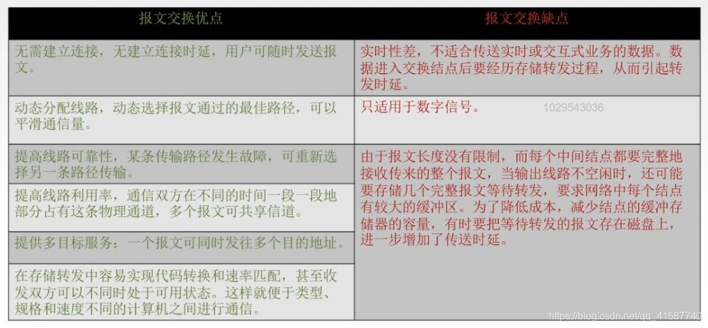

### 分组交换

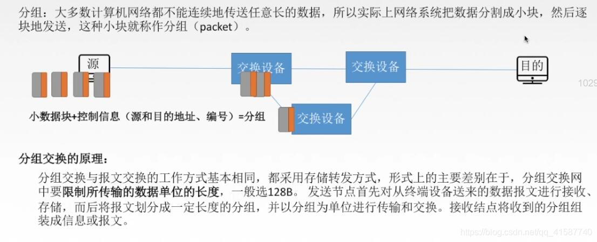

**与报文交换的唯一区别就在于他限制了一次可以发送数据块的大小，把数据报切割成许多小的数据块进行发送**

先把数据报切块，然后在每个数据块加上头部信息(编号，源地址、目的地址…),然后进行存储转发，最后接收方在拼合成一个数据报。这里的给每一个分组添加一个编号的作用就是可以让接受方按序拼合报文
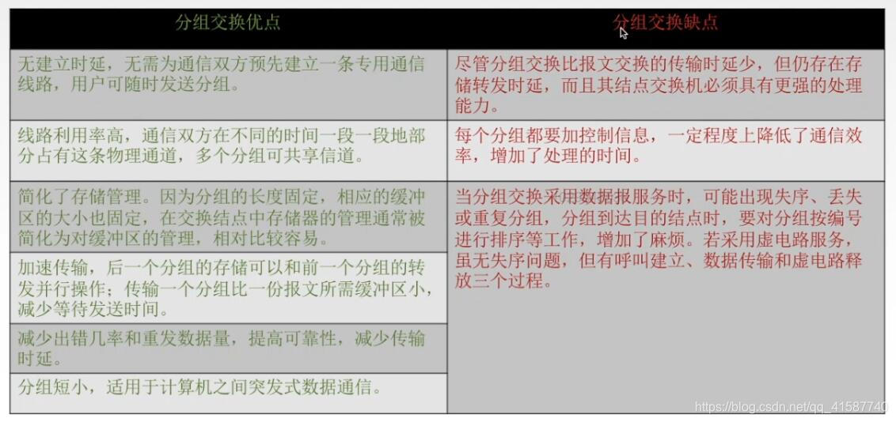

**分组交换的数据报交换方式：**

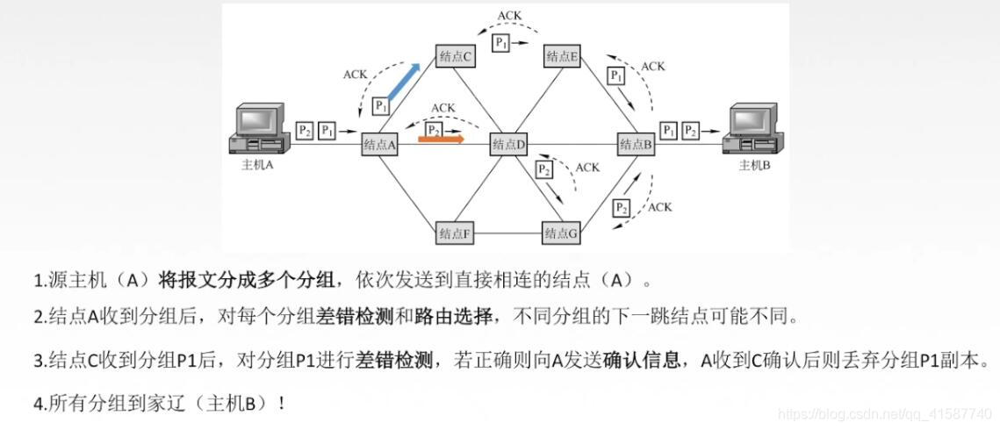

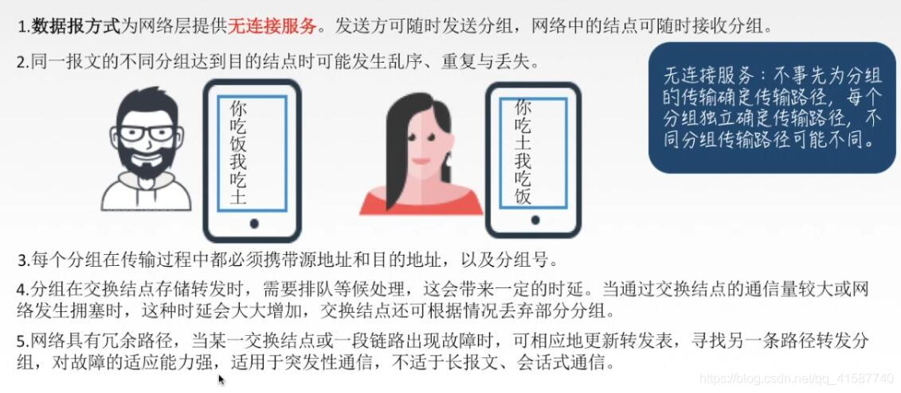

**分组交换的虚电路交换方式：**

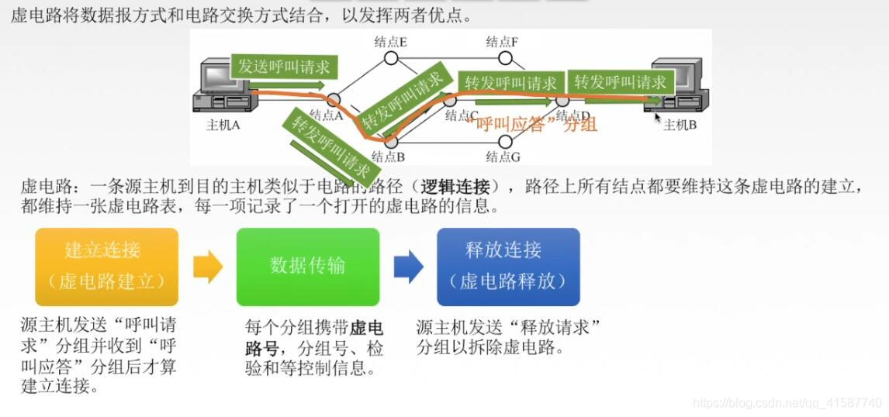

就是数据报交换方式和电路交换的结合，虚拟的建立了一条逻辑电路，结合了数据报交换方式和电路交换的优点
虚电路号：就是唯一标识虚拟电路的编号，不需要源地址目的地址

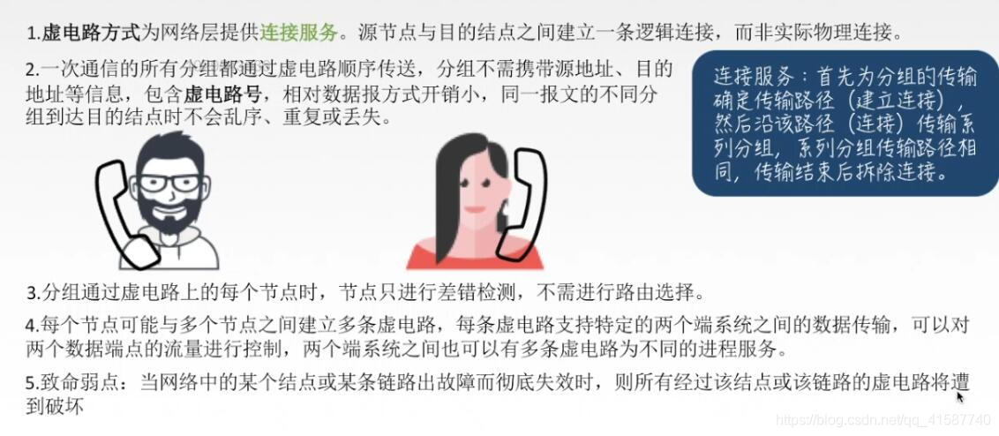

分组交换的虚电路与数据报方式的对比：

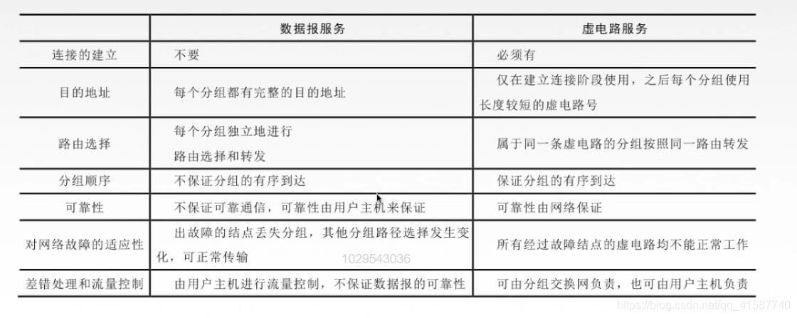

**如何选择数据的交换方式：**

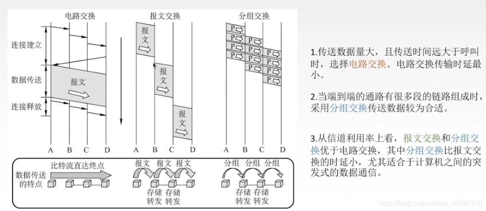
