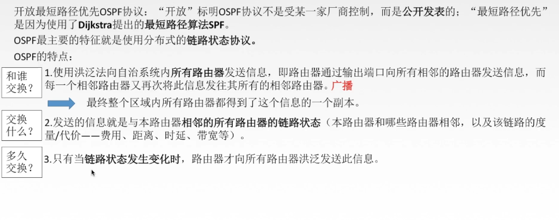
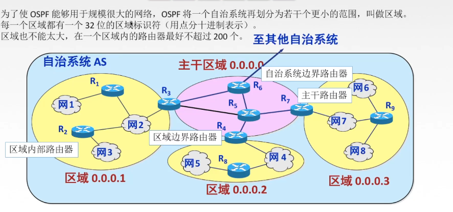
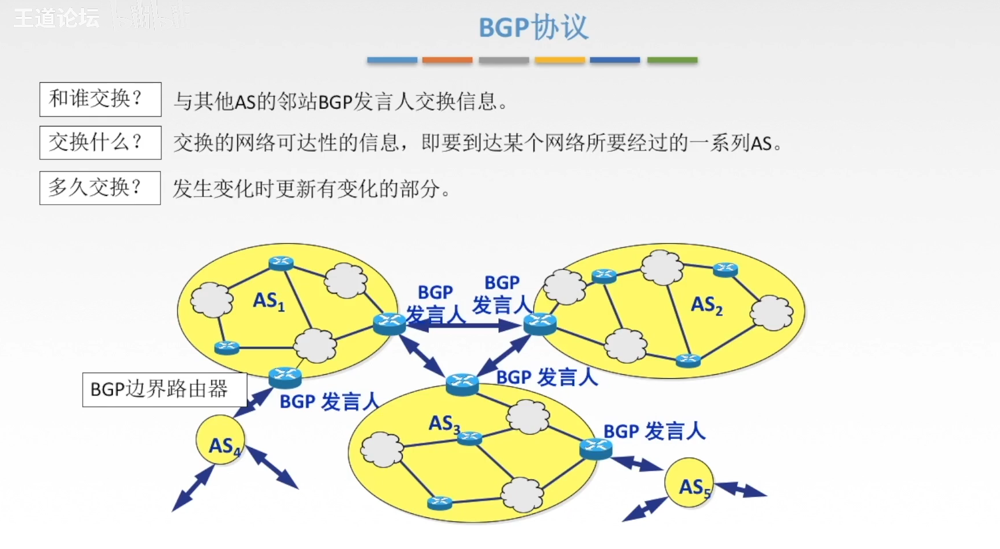
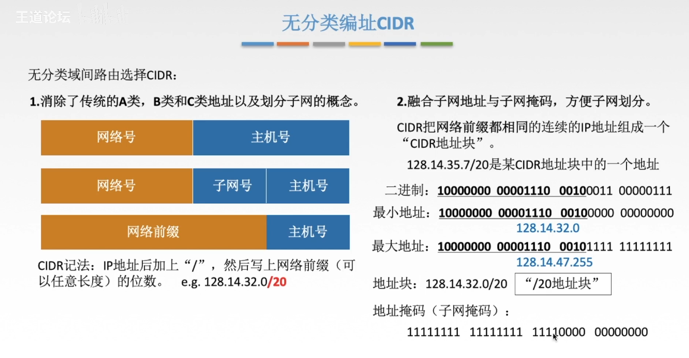
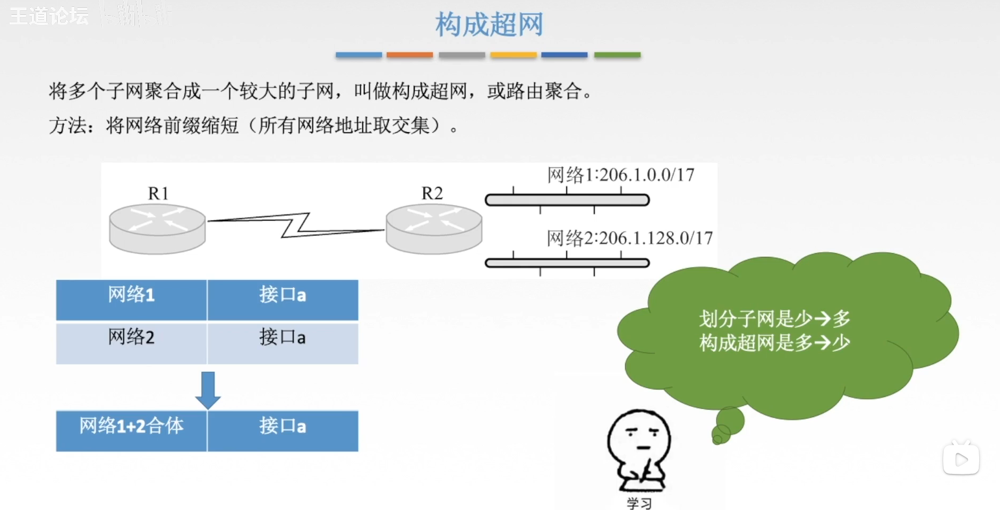

# 网络层协议

## 路由算法和路由协议概述

### 静态路由算法（非自适应路由算法）

静态路由算法是一种非自适应的路由算法，它是在网络管理员手动配置路由表中的路由信息，而不是根据网络状况或数据流量动态调整路由路径的算法。

常见的静态路由算法包括：

1. **静态最短路径路由算法**：管理员手动配置路由表以指定到达目的地的最短路径。例如，使用Dijkstra算法计算最短路径，然后手动将这些路径配置到路由器的路由表中。

2. **默认路由**：管理员可以配置默认路由，将所有未知目的地的流量转发到指定的网关。这在简化网络配置和管理时非常有用。

静态路由的主要优点是简单、稳定且不会消耗额外的网络资源。然而，它的缺点是当网络拓扑发生变化时，管理员需要手动更新路由表。这意味着静态路由不适用于大型或动态网络，因为手动更新路由表可能会变得非常繁琐且容易出错。

### 动态路由算法（自适应路由算法）一个AS（自治系统内部网关协议IGP）

#### RIP（分散性，距离向量路由算法）

RIP（Routing Information Protocol）是一种最简单的距离向量路由协议之一，用于在小型到中型规模的局域网和广域网中实现动态路由选择。

以下是一些关于RIP协议的关键特点：

1. **距离向量路由协议**：RIP使用距离向量路由算法来确定到达目的地的最佳路径。每个路由器维护一个距离向量表，其中包含到达网络中其他路由器的距离信息。
2. **基于跳数的成本**：RIP使用跳数作为路径的成本衡量标准。每个路由器通过相邻路由器到目的地网络的跳数来衡量路径的长度。最大跳数限制了网络的规模，通常RIP支持最多15跳。
3. **周期性更新**：RIP路由器周期性地向相邻路由器发送路由更新消息，以通知它们自己的路由信息。默认情况下，RIP每30秒发送一次完整路由表，以及当有路由变化时发送部分路由更新。
4. **触发更新**：当发生路由变化时，RIP会立即发送路由更新消息，而不是等待下一个周期性更新。

#### OSPF（全局性，链路状态路由算法）

### 外部网关协议EGP（AS之间使用的网关协议）BGP

外部网关协议（External Gateway Protocol，EGP）是一种过时的协议，用于在自治系统（AS）之间交换路由信息。在Internet的发展过程中，EGP被BGP（Border Gateway Protocol）所取代。

BGP是一种自治系统间的网关协议，用于在不同的自治系统之间交换路由信息。它是一种路径矢量协议，与距离向量路由协议（如RIP）和链路状态路由协议（如OSPF）不同。

BGP有以下几个重要特点：

1. **可靠性**：BGP设计用于稳定和可靠地运行在Internet中。它采用了许多机制来保证路由的可靠传递，例如路由刷新、路由回退等。

2. **灵活性**：BGP是一种非常灵活的协议，可以适应不同的网络和运营环境。它支持多种路由策略和路由控制机制，使得网络管理员能够精确地控制路由的传播和选择。

3. **路径选择**：BGP使用路径向量算法来选择最佳路径。这意味着它不仅考虑了距离，还考虑了AS路径的长度、策略、性能等因素。

4. **支持CIDR**：BGP是第一个支持CIDR（无类别域间路由）的路由协议，使得更有效的IP地址分配和路由汇总成为可能。

5. **BGP路由策略**：BGP允许网络管理员定义复杂的路由策略，例如路由过滤、路由聚合、路由重定向等，以满足不同的网络需求和安全要求。

总的来说，BGP是Internet核心路由器之间的主要协议，它承载了全球Internet的路由表，负责实现自治系统之间的路由选择和通信

## CIDR(无分类编址)

## ARP协议

ARP（Address Resolution Protocol）是一种网络协议，用于将IP地址解析为MAC地址，以便在局域网上进行通信。

在一个局域网中，计算机通常使用IP地址来标识彼此，而MAC地址是用于在局域网上唯一标识网络接口的物理地址。当计算机需要向另一个计算机发送数据时，它需要知道目标计算机的MAC地址，以便将数据正确地发送到目标。

ARP协议的工作原理如下：

1. 当一个计算机需要将数据发送到局域网上的另一台计算机时，它首先检查目标IP地址是否位于同一子网中。如果是，它会执行以下步骤：
2. 计算机首先检查本地ARP缓存（ARP Cache），看是否已经有了目标IP地址对应的MAC地址。如果有，它就可以直接将数据发送到目标计算机。
3. 如果本地ARP缓存中没有目标IP地址对应的MAC地址，计算机就会发送一个ARP请求广播到网络上的所有计算机，询问目标IP地址对应的MAC地址是什么。
4. 其他计算机接收到ARP请求后，如果发现自己的IP地址与请求中的目标IP地址相匹配，就会回复一个ARP响应，将自己的MAC地址发送给请求方。
5. 发送ARP请求的计算机收到响应后，会将目标IP地址和MAC地址的对应关系保存到本地ARP缓存中，以便将来使用。

总的来说，ARP协议允许计算机在局域网上动态地解析目标IP地址对应的MAC地址，从而实现数据的正确传输。ARP协议是网络通信中非常重要的一环，它为IP地址与MAC地址之间的映射提供了动态解析的功能。

## DHCP协议

DHCP（Dynamic Host Configuration Protocol）是一种网络协议，用于自动分配IP地址和其他网络配置信息给网络中的设备。

以下是DHCP协议的主要功能和工作原理：

1. **IP地址分配**：DHCP允许网络管理员动态地分配IP地址给网络中的设备。当设备连接到网络时，它可以通过DHCP向服务器发送请求，请求分配一个可用的IP地址。

2. **自动配置**：DHCP可以自动配置设备的网络参数，包括子网掩码、默认网关和DNS服务器等。这样，用户无需手动配置网络参数，简化了网络管理和维护工作。

3. **地址租约**：DHCP服务器通常会分配给客户端一个地址租约，包含了分配给该客户端的IP地址和其他配置信息的有效期限。一旦租约到期，客户端可以向DHCP服务器请求更新租约或者重新申请一个新的IP地址。

4. **动态IP地址管理**：DHCP允许管理员在网络中动态管理IP地址，根据网络中设备的连接状态和需求来分配和回收IP地址。

5. **消息交换**：DHCP使用客户端/服务器模型进行通信。当设备连接到网络时，它发送一个DHCP请求消息到DHCP服务器，服务器收到请求后会响应并提供相应的配置信息。

DHCP协议通过简化网络设备的配置和管理，提高了网络的灵活性和可扩展性，特别是在大型企业网络或大规模的家庭网络中。DHCP还能够有效地管理IP地址的分配和使用，减少了地址的浪费和冲突。

## ICMP协议

ICMP（Internet Control Message Protocol）是互联网控制消息协议，它是TCP/IP协议族中的一个重要组成部分。ICMP协议主要用于在IP网络中发送控制消息，用于诊断和报告关于IP网络的错误情况。

以下是ICMP协议的一些主要特点和用途：

1. **错误报告和诊断**：ICMP可以用来报告和诊断与IP通信相关的错误。例如，当一个主机无法到达目标主机时，它会发送一个ICMP消息告诉源主机。

2. **Ping工具**：ICMP最常见的用途之一是Ping工具。Ping工具用于测试两台计算机之间的连接是否正常。Ping发送ICMP Echo请求消息到目标主机，并等待目标主机的ICMP Echo回应消息。通过Ping工具，管理员可以检测网络中主机之间的连通性和延迟。

3. **生存时间和片段的跟踪**：ICMP还可以用于生存时间（TTL）和片段跟踪。当一个IP数据包经过路由器时，路由器会减少生存时间字段的值，并在生存时间减少到0时丢弃数据包，然后向源主机发送一个ICMP超时消息。

4. **路由发现**：ICMP还可以用于路由发现。它允许一个主机发现到达目标主机的最佳路径。

总的来说，ICMP是TCP/IP协议栈中一个非常重要的协议，它提供了网络诊断和错误报告的机制，帮助网络管理员更好地管理和维护IP网络。
