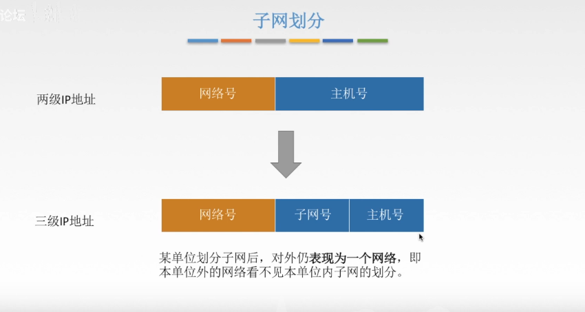

# 网络编制问题

## 子网

**网络号和子网号合成三级IP地址的子网掩码，子网掩码将主机号Ip地址的位置全部置为0，将网络号和子网号的合成的IP地址的位置全部置为1**

## 如何查看服务器的CIDR

要查看服务器的CIDR，您需要了解服务器的IP地址和网络掩码。

CIDR（无类别域间路由）是一个简化的IP地址分配方案，它使用一个IP地址和一个掩码来定义一个网络。掩码定义了IP地址中哪些位用于网络地址，哪些位用于主机地址。

要查看服务器的CIDR，请执行以下步骤：

1. 打开命令行界面。

2. 输入以下命令以查看服务器的IP地址和网络掩码：

   `ipconfig`

3. 查找网络接口的IP地址和子网掩码。子网掩码可以在与inet（IPv4）或inet6（IPv6）相应的行中找到。子网掩码通常以“/”符号后跟数字表示，例如“/24”。

4. 使用IP地址和子网掩码计算服务器的CIDR。

   对于IPv4地址，可以使用以下公式计算CIDR：CIDR = IP地址/子网掩码位数。

   例如，如果服务器的IP地址是192.168.0.1，子网掩码是255.255.255.0，则CIDR为192.168.0.1/24。

### 只有内网才有CIDR编址吗

CIDR（无类别域间路由）编址是一种将IP地址和子网掩码组合在一起的方法，以定义一个IP网络范围。CIDR编址不是只用于内网，它可以用于任何IP网络。

CIDR编址在Internet中被广泛使用，用于划分大型IP地址块并将它们分配给不同的ISP（互联网服务提供商）和其他组织。CIDR编址也用于路由器和其他网络设备，以帮助它们确定如何转发IP数据包。

在内网中，CIDR编址通常用于划分IP地址池，以便将地址分配给不同的设备和子网络。通过使用CIDR编址，可以更有效地使用IP地址，并且可以更容易地管理和维护网络。

因此，CIDR编址不是只用于内网，而是可以用于任何IP网络。

**CIDR就是将网络号和主机号合并成网络前缀所构成的，转化成二级IP地址，但是网络前缀是可变长的，所以现在广泛使用。**