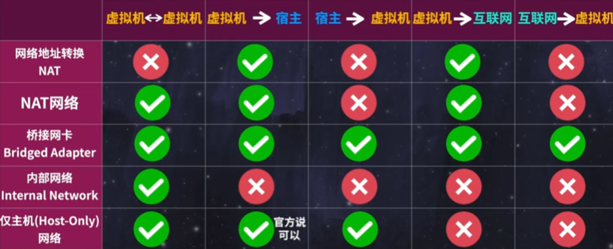
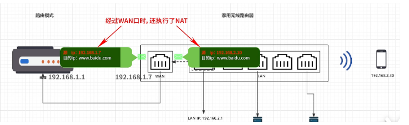

# 网络

## 虚拟机网络

## 网卡

网卡（Network Interface Card），也被称为网络适配器、网卡或网卡接口，是计算机用于连接到计算机网络的硬件设备。它是计算机与网络之间进行数据通信的关键组件。

网卡通常是一个插入计算机主板的扩展卡或一个集成在主板上的组件。它提供了与网络通信所需的物理接口和相关的电路。网卡负责将计算机内部的数据转换成适合在网络上传输的格式，并将其发送到网络上，同时也负责接收来自网络的数据，并将其转换为计算机可理解的形式。

网卡的主要功能包括：

1. 物理连接：网卡通过网线或光纤等物理介质与网络连接，使计算机能够与其他计算机或网络设备进行数据交换。

2. 数据传输：网卡负责将计算机内部的数据包转换成适合在网络上传输的格式，并将其发送到网络上。它也接收来自网络的数据包，并将其传递给计算机的其他部件进行处理。

3. MAC地址识别：**每个网卡都有一个唯一的物理地址，称为MAC地址（Media Access Control Address）**。MAC地址用于在局域网中唯一标识网卡，使得数据能够准确地传输到目标设备。

4. 数据包处理：网卡能够处理网络数据包，包括检查数据包的完整性、校验和和错误处理。它还可以根据网络协议（如以太网、无线网络等）进行数据包的解析和组装。

5. 速度和协议适配：网卡支持不同的网络速度和协议，如以太网、Wi-Fi等。它能够自动适配不同的网络环境，并与其他设备进行通信。

网卡是计算机连接到网络的关键组件，它使得计算机能够进行网络通信，访问互联网，以及与其他计算机和设备进行数据交换。

### 信号转换

当网卡接收到传输在网络介质（如以太网电缆）上的电信号时，它使用一种叫作采样的技术来将连续的模拟信号转换成离散的数字信号。采样是指在一定的时间间隔内对信号进行测量和记录。

采样过程中，网卡会定期测量电信号的电压值，并将其转换为数字表示。这个过程通常使用模数转换器（Analog-to-Digital Converter，简称ADC）来完成。模数转换器将连续变化的模拟信号离散化，转换成一系列数字值，以表示原始信号的特征。

一旦电信号被转换为数字信号，网卡就可以将其传递给计算机处理，进行进一步的解析、处理和传输。

所以，在接收信息时，网卡将电信号转换成数字信号，而在发送信息时，网卡将计算机中的数字信号转换成电信号，以便在网络中进行传输。

**每一个网卡都有独立的mac地址**

## 网关

在计算机网络中，网关（Gateway）是连接两个或多个网络的设备或软件。它可以实现不同网络之间的数据转发、协议转换和数据包过滤等功能。网关通常位于网络边缘，用于连接本地网络与外部网络，使得不同网络之间可以进行通信。

网关的IP地址通常是与本地局域网的子网一致的。在常见的家庭或小型办公网络中，使用的是私有IP地址范围，其中最常见的是使用子网掩码为 255.255.255.0 的子网。在这种情况下，通常将网关的IP地址设置为该子网的第一个可用地址，即 x.x.x.1。

例如，如果局域网的IP地址范围是 192.168.0.0/24，其中 192.168.0.1 是路由器的IP地址，那么该IP地址就是网关的IP地址。其他设备在局域网中的IP地址可能是 192.168.0.2、192.168.0.3，以此类推。

### Lan口和Wan口

LAN口（Local Area Network）是连接到局域网的接口，用于与本地设备进行通信。LAN口的IP地址是在局域网中分配给路由器的地址，用于在局域网内部进行通信。这个IP地址是在私有IP地址范围内的，比如常见的是 192.168.x.x 或 10.x.x.x。

WAN口（Wide Area Network）是连接到广域网（如互联网）的接口，用于与外部网络进行通信。WAN口的IP地址是由网络服务提供商（ISP）分配的公共IP地址。这个IP地址是唯一且可公开访问的，用于在互联网上与其他网络进行通信。

## 多播和广播

多播是相对与单播和广播来说了。
单播是一个地址发送一个数据包，另一个地址收到；
广播是一个地址发送一个数据包，局域网中所有地址都收到；
多播就基于单播与广播之间，一个地址发送一个数据包，局域网中部分地址收到，部分地址收不到。

怎么才能让一部分地址收到一部分地址收不到呢？

**做法就是：**

首先选一个多播地址和端口，数据接收方选择一个网卡（要连接到局域网的）监听这个多播地址和端口，数据发送方向这个多播地址和端口发送数据，这样监听了多播地址与端口的接收方就都可以收到发送方的数据了，没有监听的自然也就收不到了。

**下面是更详细的多播通信流程：**

1. 选择多播地址和端口：发送方和接收方需要在通信前确定使用的多播地址和端口。多播地址用于标识多播组，而端口用于标识应用程序或服务。

2. 接收方加入组播组：接收方需要将自己加入到特定的多播组中，以便接收该组的数据。接收方通过选择一个网卡并在该网卡上监听指定的多播地址和端口，来表示它对该多播组感兴趣。
3. 发送方发送数据：发送方通过指定目标多播地址和端口，将数据发送到该多播组。数据可以是任何形式的信息，例如音频、视频、文本等。
4. 数据在网络中传播：网络中的路由器会根据多播路由协议的配置，将发送方的数据包复制并转发到所有加入了该多播组的接收方。这样，所有接收方都能接收到相同的数据。
5. 接收方接收数据：接收方的网卡监听指定的多播地址和端口，当网络中有数据包到达时，网卡会将数据包传递给接收方应用程序或服务进行处理。

需要注意的是，多播通信需要网络基础设施支持，包括支持多播传输的路由器和交换机。此外，接收方和发送方都必须在相同的网络或子网中，才能正确地接收和发送多播数据。

通过选择相同的多播地址和端口，以及加入相同的多播组，接收方可以接收到发送方发送的多播数据。其他未加入该多播组的设备将无法接收到数据，因为它们没有监听该特定的多播地址和端口。这使得多播通信可以实现一对多的数据传输，提供了一种高效的方式来进行广播和共享数据。

**选择ip和端口**

要选择一个网卡并在该网卡上监听指定的多播地址和端口，可以按照以下步骤进行操作：

1. 确定可用的网卡：首先，确定计算机上可用的网卡接口。可以使用操作系统提供的网络配置工具（如`ipconfig`、`ifconfig`等）来列出可用的网卡接口。通常，网卡接口以类似于 "eth0"、"en0" 或 "wlan0" 的标识符表示。

   "eth0"、"en0"和"wlan0"是常见的网卡接口命名约定，它们通常用于表示不同类型的网络接口。

   1. "eth0"：这是以太网（Ethernet）网卡接口的命名约定，常用于Linux系统。数字后缀可以是0、1、2等，用于区分多个以太网接口。
   2. "en0"：这是以太网（Ethernet）网卡接口的命名约定，常用于Mac系统。与Linux系统类似，数字后缀用于区分多个以太网接口。
   3. "wlan0"：这是无线局域网（Wireless LAN）网卡接口的命名约定，常用于Linux和Mac系统。与以太网接口类似，数字后缀用于区分多个无线局域网接口。

   这些命名约定可能因操作系统和网络配置而有所不同。不同的操作系统和网络管理工具可能采用不同的命名约定来标识网卡接口。因此，具体的命名约定可能因你所使用的操作系统和网络设备而有所不同。

2. 选择目标网卡：根据你的需求，选择要用于监听多播地址和端口的目标网卡接口。这通常是与你要**连接到的局域网或子网相关联的网卡。**

3. 配置网卡监听：使用编程语言或网络编程库，编写一个程序或服务，以便在目标网卡上监听指定的多播地址和端口。具体的配置步骤可能因所选的编程语言或库而异，但基本的步骤通常包括以下内容：

   - 创建一个套接字（Socket）对象，以便进行网络通信。
   - 将套接字绑定（Bind）到目标网卡的IP地址和端口号。
   - 设置套接字选项，以允许接收多播数据。
   - 加入指定的多播组，以表明你对该多播组感兴趣。

4. 监听多播数据：启动程序或服务，使其开始在目标网卡上监听指定的多播地址和端口。程序将开始接收和处理到达该地址和端口的多播数据。

请注意，具体的实现细节可能因所选的编程语言、操作系统和网络编程库而有所不同。使用网络编程的专门知识和适当的编程语言文档可以帮助你更详细地了解如何在特定环境中选择网卡并监听指定的多播地址和端口。

**多播地址**

IPv4地址空间中定义了一些用于多播（Multicast）的特殊IP地址范围。以下是一些常见的多播地址范围：

1. 224.0.0.0 到 224.0.0.255：这是预留的本地多播地址范围，用于特定目的，如路由协议和其他网络控制消息。
2. 224.0.1.0 到 238.255.255.255：这是全球范围的多播地址范围，可供公共互联网使用。在这个范围内，有一些已经被分配给特定的多播组，用于各种应用。
3. 239.0.0.0 到 239.255.255.255：这是本地管理员多播地址范围，用于本地网络内的特定应用和组播组。

**广播地址**

广播地址 192.168.1.255 是在一个局域网（同一个子网）中向所有主机发送信息的地址。当你发送一个数据包到广播地址时，局域网上的所有主机都会接收到这个数据包。

在 IPv4 网络中，广播地址通常是某个子网的最后一个地址。对于以 192.168.1.0/24 为例的子网，该子网的广播地址就是 192.168.1.255。最后一个地址被保留作为广播地址，用于向子网内的所有主机发送广播消息。

当你发送一个数据包到广播地址 192.168.1.255，该数据包将被交换机或路由器转发到同一局域网中的所有主机。这样，所有处于该子网中的主机都能接收到这个数据包。然后，每个主机可以根据自己的网络应用程序或配置对该数据包进行处理。

需要注意的是，广播消息只能在同一子网中传播。如果你想向不同子网的主机发送广播消息，需要使用特定的广播中继机制（如 DHCP Relay）或其他网络设备来实现跨子网的广播。

## 特殊IP地址

特殊的IP地址是指在IP地址空间中具有特殊用途或保留用途的地址。这些地址被保留，不用于普通的主机或设备分配，而是用于特定的网络功能、测试、私有网络等。

以下是一些常见的特殊IP地址及其作用：

1. 127.0.0.1：这是本地回环地址（Loopback Address），也被称为localhost。它用于将网络通信导向回同一台计算机，用于本机测试和网络服务的调试。

2. 0.0.0.0：这是通配符地址（Wildcard Address），用于表示**当前网络上的所有IP地址**。在某些情况下，它可以表示未指定或不可用的地址。

   在IPv4中，一个网络接口是指与计算机连接的网络设备，例如网卡（Network Interface Card）。每个网络接口都可以分配一个或多个IP地址，用于唯一标识该接口在网络上的位置。

   "IPv4地址中的所有网络接口"表示在该计算机上的所有网络接口上都监听指定的端口。这意味着无论计算机上有多少个网络接口（可以是物理接口或虚拟接口），都将通过这些接口上的IP地址来接收传入的数据包，并将其传递给相应的应用程序进行处理。这样可以确保在所有网络接口上都能够接受到特定端口上的传入连接或通信。

3. 169.254.0.0 到 169.254.255.255：这是自动私有IP地址（Automatic Private IP Addressing，APIPA）范围。当设备无法从DHCP服务器获取有效的IP地址时，它可以自动分配一个APIPA地址，以使设备在局域网上进行自我配置。

4. 192.168.0.0 到 192.168.255.255、172.16.0.0 到 172.31.255.255、10.0.0.0 到 10.255.255.255：这些是私有IP地址范围，用于在私有网络中分配IP地址。这些地址不在公共互联网上路由，因此被用于内部网络，如家庭网络、办公室网络或企业内部网络。

5. 255.255.255.255：这是广播地址（Broadcast Address），用于将数据包发送到当前网络上的所有设备。当一个数据包被发送到广播地址时，网络上的所有设备都会接收到该数据包。

这些特殊IP地址在网络中发挥着不同的作用。它们用于特定的网络功能、配置和测试，或者用于私有网络的内部通信。了解这些特殊IP地址的作用对于理解和管理网络是很重要的。

**在 IPv4 地址中，没有像 IPv6 地址中的 "::"（通配符）一样的直接通配符表示所有地址的符号。**

然而，在某些上下文中，可以使用特定的地址或地址范围来表示类似通配符的功能。以下是一些常见的表示方式：

1. 0.0.0.0：这是一个特殊的 IPv4 地址，通常称为 "全零地址" 或 "任意地址"。它表示所有 IPv4 地址，类似于 IPv6 中的 "::"。监听在 "0.0.0.0" 上的服务将接受来自任何 IPv4 地址的连接。

2. 127.0.0.1：这是本地回环接口的 IPv4 地址，通常称为 "localhost" 或 "环回地址"。它表示计算机本身，用于在计算机内部进行本地通信。监听在 "127.0.0.1" 上的服务只能从计算机本身访问，不接受来自外部网络的连接。

请注意，这些表示方式是针对特定的网络需求和应用程序而定义的，不能广泛用于所有情况。具体使用哪种方式取决于您的具体情况和应用程序的要求。

**":::8000" 和 "0.0.0.0:8000" 在表示网络监听地址时有一些区别：**

1. ":::8000" 是 IPv6 地址的表示形式。"::" 表示 IPv6 中的任意地址（通配符），表示监听所有可用的 IPv6 地址。因此，":::8000" 表示在所有 IPv6 网络接口上监听端口 8000。

2. "0.0.0.0:8000" 是 IPv4 地址的表示形式。"0.0.0.0" 也是一个特殊的地址，表示监听所有可用的 IPv4 地址。因此，"0.0.0.0:8000" 表示在所有 IPv4 网络接口上监听端口 8000。

简而言之，两者都表示在所有网络接口上监听特定端口，但 ":::8000" 适用于 IPv6 地址，而 "0.0.0.0:8000" 适用于 IPv4 地址。根据网络环境和应用程序的要求，可以选择使用适当的格式。

## A，B，C类地址（私有IP）
**A类地址简介**

⑴ A类地址第1字节为网络地址，其它3个字节为主机地址。另外第1个字节的最高位固定为0。

⑵ A类地址范围：0.0.0.0到127.255.255.255。

⑶ A类地址中的保留地址：127.0.0.0到127.255.255.255是保留地址，用做循环测试用的。

A类私有地址

在A类地址中，10.0.0.0到10.255.255.255是私有地址（所谓的私有地址就是在互联网上不使用，而被用在局域网络中的地址）。

**B类地址简介**

(1)B类地址第1字节和第2字节为网络地址，其他2个字节为主机地址。另外1个字节的前2位固定为10.

⑵ B类地址范围：128.0.0.0到191.255.255.255。

⑶ B类地址中的保留地址：169.254.0.0到169.254.255.255是保留地址。如果你的IP地址是自动获取IP地址，而你在网络上又没有找到可用的DHCP服务器，这时你将会从169.254.0.1到169.254.255.254中临时获得一个IP地址。

B类私有地址

在B类地址中，172.16.0.0到172.31.255.255是私有地址。

**C类地址简介**

⑴ C类地址第1字节、第2字节和第3个字节为网络地址，第4个个字节为主机地址。另外第1个字节的前三位固定为110。

⑵ C类地址范围：192.0.0.0到223.255.255.255。

C类私有地址

在C类地址中，192.168.0.0到192.168.255.255是私有地址。

**排除 该网段 两个特殊地址：**

　　广播地址：192.168.1.255　　（主机号全为11111111）

　　网络地址：192.168.1.0 　　　（主机号全为00000000）

## 光猫和路由器连接方式

除了路由模式，光猫和路由器之间还可以使用桥接模式进行连接。

1. 路由模式（Router Mode）：在路由模式下，光猫将作为一个路由器，它负责处理网络地址转换（NAT）、DHCP服务器等功能，将互联网信号转发给路由器的WAN口，并为局域网内的设备提供私有IP地址。路由器则负责进一步处理网络流量、提供内部网络管理和安全功能。

2. 桥接模式（Bridge Mode）：在桥接模式下，光猫不再执行路由功能，而是将网络信号通过一个透明的桥接连接转发给路由器。光猫和路由器之间的连接成为透明桥接，路由器负责处理网络地址转换、DHCP服务器等功能，同时也管理局域网内的设备。

在桥接模式下，光猫将直接将互联网信号传递给路由器，而不对网络流量进行任何处理。这样，路由器可以直接获得公共IP地址，并且网络配置和管理更加简化，因为所有的网络功能都由路由器完成。**（此时光猫没有IP地址）**

需要注意的是，不同的光猫设备和网络服务提供商可能具有不同的连接模式选项和支持。具体的连接方式和设置可以咨询网络服务提供商或参考设备的用户手册。
