# 链路层协议

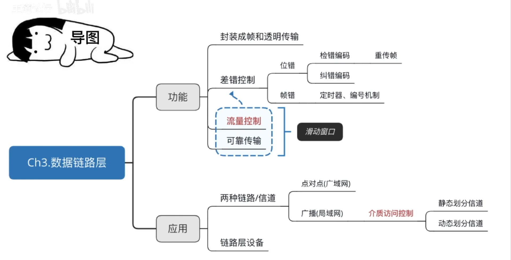

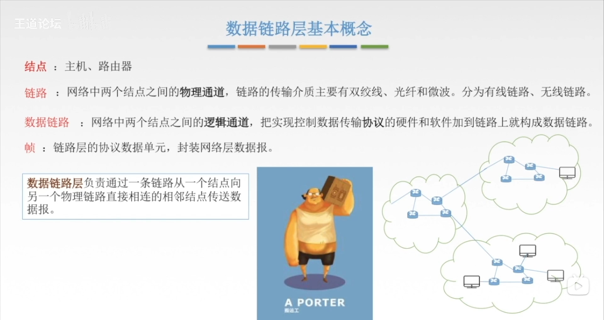

## 差错控制

数据链路层的差错控制是指在数据链路层上通过各种技术和协议来检测和纠正数据传输过程中可能发生的错误。差错控制主要涉及以下几个方面：

1. **奇偶校验（Parity Check）**：奇偶校验是一种简单的差错控制方法，通过在数据位中添加一个额外的校验位，使得数据位中的1的个数为奇数或偶数。接收方可以根据接收到的数据位和校验位的奇偶性来检测错误。

2. **循环冗余校验（Cyclic Redundancy Check，CRC）**：CRC是一种更强大的差错控制方法，它通过对数据进行多项式计算来生成一个校验码，发送方将校验码附加到数据帧上发送，接收方使用相同的多项式计算方法来验证数据的正确性。

3. **帧同步和字节填充**：在数据链路层，帧同步和字节填充是用来保证数据帧的同步性和完整性的方法。帧同步是通过特殊的比特序列来标识帧的开始和结束，而字节填充则是在数据中插入特殊的字节来避免和控制帧同步序列的出现。

4. **重发请求和确认（ARQ）**：ARQ是一种通过在数据传输过程中进行反馈来实现差错控制的方法。如果接收方检测到错误，它可以向发送方发送一个请求重发的信号，直到接收到正确的数据。

5. **前向纠错（Forward Error Correction，FEC）**：FEC是一种通过在发送端添加冗余数据来纠正接收端可能出现的错误的技术。接收方可以使用冗余数据来纠正一定数量的错误。

这些差错控制技术可以单独或者组合使用，具体取决于网络和系统的要求，以及对传输质量和可靠性的需求。

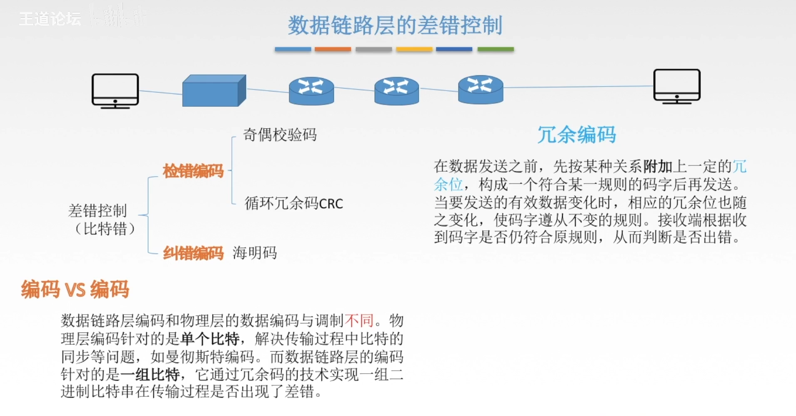

## 滑动窗口

### 流量控制/可靠传输

#### 停止等待协议

停止等待协议（Stop-and-Wait Protocol）是一种简单的数据链路层协议，用于可靠地传输数据帧。它的工作原理如下：

1. **发送方行为**：
   - 发送方将数据帧发送给接收方。
   - 发送方等待接收到来自接收方的确认帧。
   - 如果在一定时间内没有收到确认帧，发送方会重传相同的数据帧。

2. **接收方行为**：
   - 接收方接收到数据帧后，如果数据帧没有错误，会发送一个确认帧给发送方。
   - 如果接收方检测到数据帧有错误，它会丢弃该数据帧，并不发送确认帧。

停止等待协议的特点包括：

- **可靠性**：发送方会一直等待确认帧，直到它收到确认帧为止。这确保了数据的可靠传输，因为发送方会重传丢失的数据帧。
- **简单性**：停止等待协议非常简单，易于理解和实现。它适用于对实时性要求不高的简单通信系统。
- **效率低**：停止等待协议的效率不高，因为发送方必须等待确认帧，这会导致网络资源的浪费。在网络延迟较高或丢包率较高的情况下，协议的效率更低。

停止等待协议在很多情况下都是一种有效的选择，特别是在数据传输要求不高、网络稳定的情况下。然而，在大多数实际应用中，由于其效率较低，通常会选择更复杂但更高效的协议，如选择重传协议（Selective Repeat Protocol）或连续ARQ协议（Continuous ARQ Protocol）。

#### GBN协议（后退N帧协议）

GBN（Go-Back-N）协议是一种数据链路层的协议，属于后退N帧协议的一种。它允许发送方连续发送多个数据帧而不需要等待确认，但是接收方必须按照顺序接收数据帧。当接收方检测到有丢失的帧时，它会丢弃当前所有的帧，并要求发送方重新发送这些帧。

GBN协议的主要特点包括：

1. **连续发送**：发送方可以连续发送多个数据帧，而不需要等待确认。
2. **有序接收**：接收方必须按照顺序接收数据帧。如果接收方检测到有丢失的帧，它会丢弃当前的所有帧，并要求发送方重新发送这些帧及其之后的所有帧。
3. **滑动窗口**：GBN协议使用滑动窗口机制来控制发送和接收的窗口大小，以确保网络的吞吐量和效率。
4. **超时重传**：发送方会设置一个定时器，如果在规定的时间内没有收到确认帧，发送方会重传窗口中的所有未确认的帧。
5. **选择重传**：GBN协议属于一种选择性重传协议，它允许发送方只重传丢失的帧，而不是重传所有的帧。

GBN协议在实践中被广泛应用，特别是在具有较低丢包率的网络环境中。它简单而有效，能够提供一定程度的可靠性和效率。然而，当网络出现丢包率较高的情况时，GBN协议的效率可能会降低，因为它需要等待确认，这可能导致网络资源的浪费。

#### SR协议（选择重传协议）

SR协议（Selective Repeat Protocol）是数据链路层的一种协议，也是一种后退N帧协议，与GBN协议相似。SR协议允许发送方同时发送多个数据帧，接收方可以选择性地确认已接收的帧，而不必等待下一个帧的顺序。

SR协议的主要特点包括：

1. **选择性确认**：接收方可以选择性地确认已经成功接收的数据帧，而不必等待下一个帧的顺序。这使得接收方可以更灵活地处理接收到的帧，减少了网络延迟。

2. **滑动窗口**：SR协议使用滑动窗口机制来控制发送和接收的窗口大小，以保持网络的吞吐量和效率。

3. **超时重传**：发送方会设置定时器，如果在规定的时间内没有收到确认帧，发送方会重传未收到确认的帧。

4. **选择重传**：SR协议允许发送方只重传丢失的帧，而不是重传整个窗口的所有帧。

与GBN协议相比，SR协议允许接收方选择性地确认接收到的帧，从而提高了网络的效率和吞吐量。它更适合在丢包率较低的网络环境中使用，因为它提供了更灵活的确认和重传机制。然而，与GBN协议相同，SR协议也需要维护较大的窗口大小以提高吞吐量，这可能会增加网络负担。

## 信道划分介质访问控制（动态划分）

### ALOHA协议

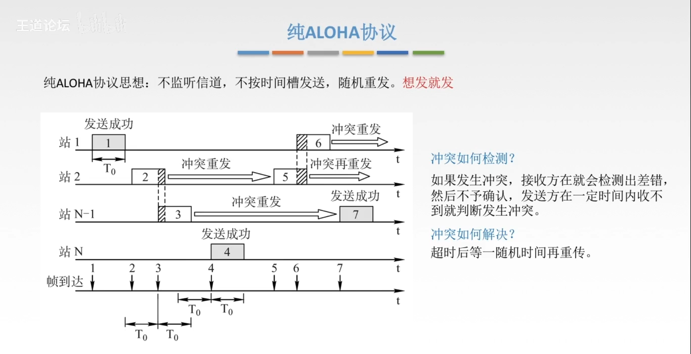

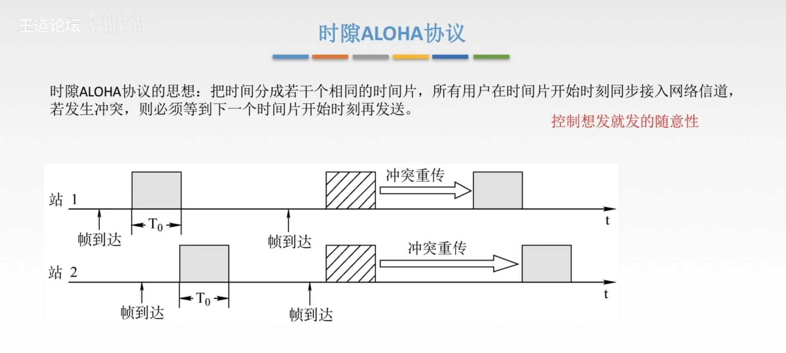

### CSMA协议

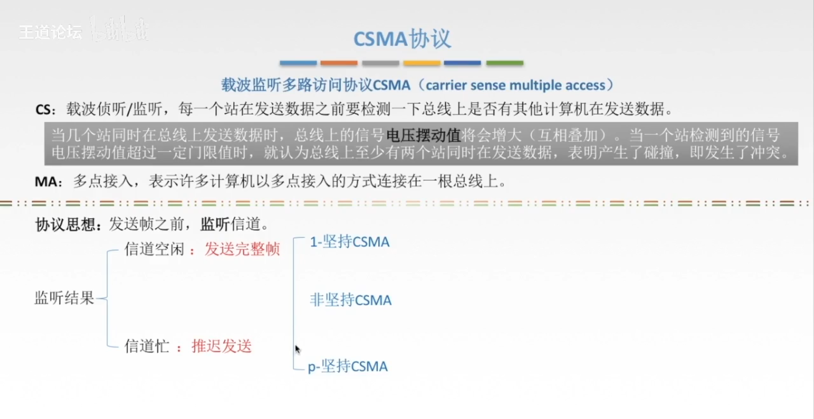

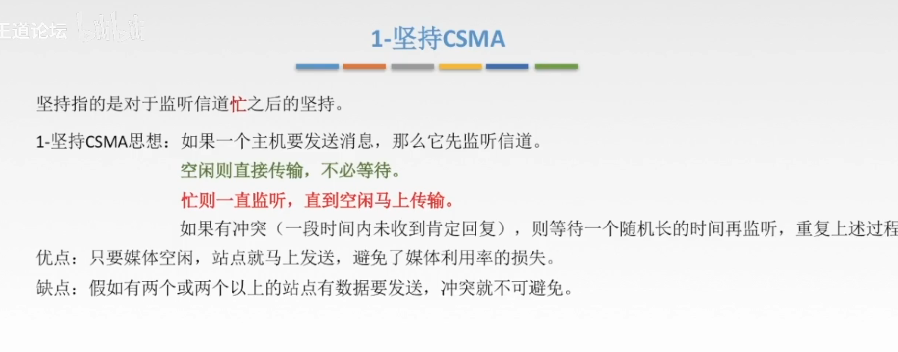

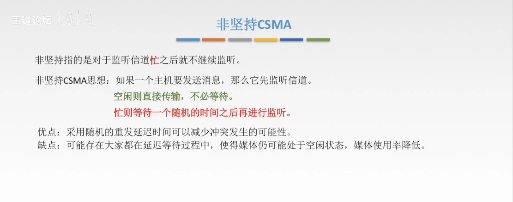

### CSMA-CD

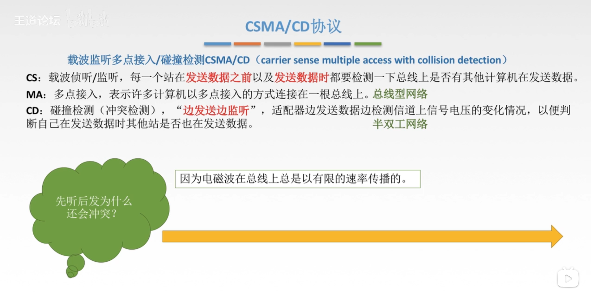

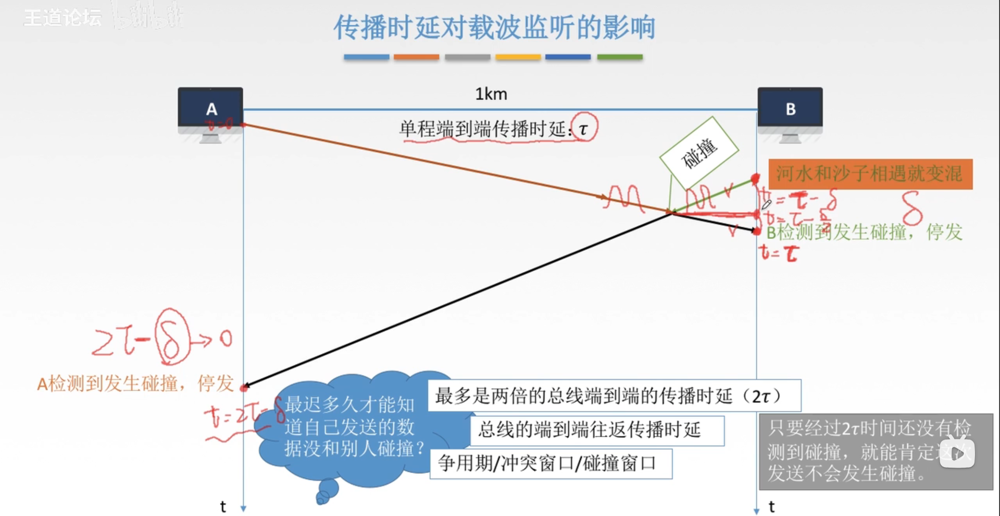

### CSMA-CA

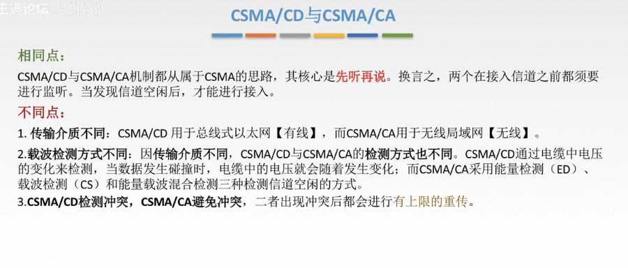

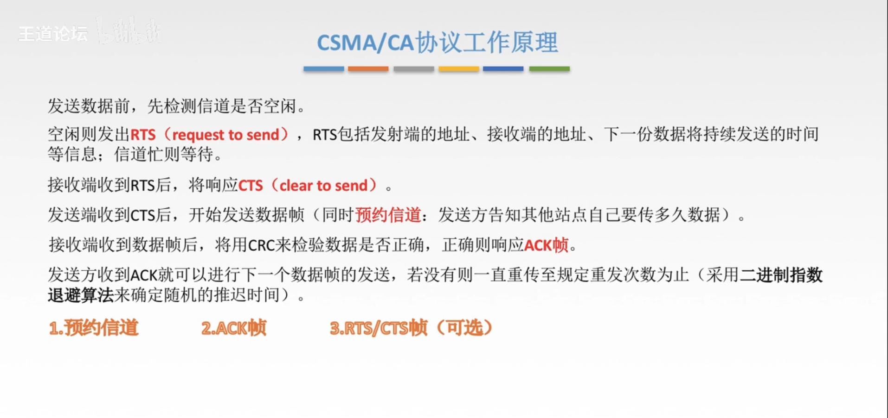

