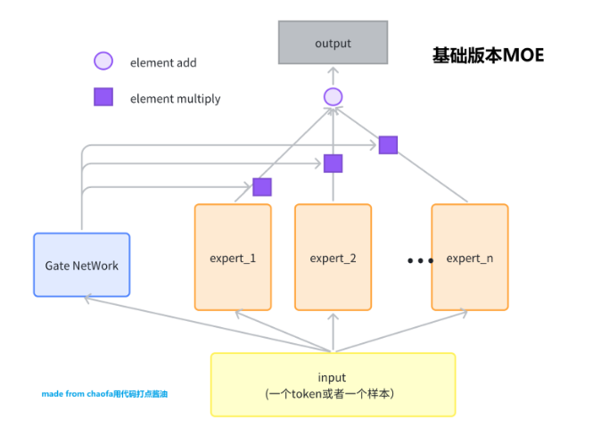
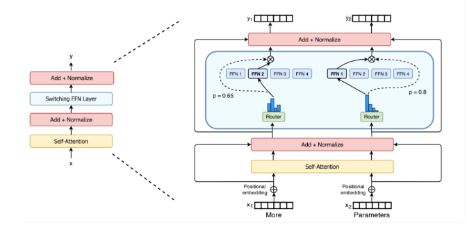
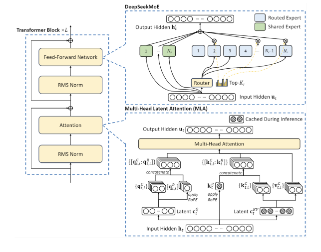

## 1. 阅读前提
本次课一共讲解三个不同版本的 MOE，分别是基础版MOE，大模型训练用的 SparseMoE，还有 DeepSeek 用的比较多的 shared_expert 的 SparseMoE。
- 基础版MOE。理解 MOE 在干什么？
- 大模型训练用的 SparseMoE。了解大模型怎么做 MOE 训练？
- Deepseek 用的 shared_expert SparseMoE。了解 MOE 模型如何进化？
- 视频讲解见： [完全从零手写MOE大模型，复现 DeepSeek MOE 算法，彻底掌握 MOE 算法进化之路](https://www.bilibili.com/video/BV1ZbFpeHEYr/)

## 2. 版本1：基础版本MOE
输入是一个 Token, 输出是一个 Token Embedding。暂时先不考虑 MOE 得到的  Embedding 怎么使用。

因为 MOE 网络对应着 Expert，这个 Expert 一般是一个 FeadFoward Network，FFN。而为了简化，后续我们都用一层的 Linear 代替，更高级版本的 Expert 留给大家当做课后作业。下面是一个专家的定义。
```python
class BasicExpert(nn.Module):
    # 一个 Expert 可以是一个最简单的， linear 层即可
    # 也可以是 MLP 层
    # 也可以是 更复杂的 MLP 层（active function 设置为 swiglu）
    def __init__(self, feature_in, feature_out):
        super().__init__()
        self.linear = nn.Linear(feature_in, feature_out)
    
    def forward(self, x):
        return self.linear(x)
```

基础版本的 MOE 可以看这个图，非常的简单。



```python

class BasicMOE(nn.Module):
    def __init__(self, feature_in, feature_out, expert_number):
        super().__init__()
        self.experts = nn.ModuleList(
            [
                BasicExpert(feature_in, feature_out) for _ in range(expert_number)
            ]
        )
        # gate 就是选一个 expert 
        self.gate = nn.Linear(feature_in, expert_number)
    
    def forward(self, x):
        # x 的 shape 是 （batch, feature_in)
        expert_weight = self.gate(x)  # shape 是 (batch, expert_number)
        expert_out_list = [
            expert(x).unsqueeze(1) for expert in self.experts
        ]  # 里面每一个元素的 shape 是： (batch, ) ??

        # concat 起来 (batch, expert_number, feature_out)
        expert_output = torch.cat(expert_out_list, dim=1)

        # print(expert_output.size())

        expert_weight = expert_weight.unsqueeze(1) # (batch, 1, expert_nuber)

        # expert_weight * expert_out_list
        output = expert_weight @ expert_output  # (batch, 1, feature_out)
        
        return output.squeeze()


def test_basic_moe():
    x = torch.rand(2, 4)

    basic_moe = BasicMOE(4, 3, 2)
    out = basic_moe(x)
    print(out)


test_basic_moe()

```

## 2. 版本2：SparseMoE （大模型训练使用）
这个一般我们用 switch transformers 这篇文章的图作为演示，详情看：




和 Basic 区别是，MOE 选择 topK 个专家，然后对这 topK 个专家的输出进行加权求和，并且把输入样本变成了大模型中真实的输入 Shape，(batch, seq_len, hidden_dim)

```python

# 主要参考自 mistral MOE 的实现

class MOERouter(nn.Module):
    def __init__(self, hidden_dim, expert_number, top_k):
        super().__init__()
        self.gate = nn.Linear(hidden_dim, expert_number)
        self.expert_number = expert_number
        self.top_k = top_k
    
    def forward(self, hidden_states):
        # 计算路由logits
        router_logits = self.gate(hidden_states)  # shape is (b * s, expert_number)
        
        # 计算专家经过softmax之后的概率
        routing_probs = F.softmax(router_logits, dim=-1, dtype=torch.float)
        
        # 计算topk的专家的输出
        router_weights, selected_experts = torch.topk(
            routing_probs, self.top_k, dim=-1
        )  # shape都是 (b * s, top_k)
        
        # 专家权重归一化
        router_weights = router_weights / router_weights.sum(dim=-1, keepdim=True)
        router_weights = router_weights.to(hidden_states.dtype)
        
        # 生成专家掩码
        expert_mask = F.one_hot(
            selected_experts,
            num_classes=self.expert_number
        )  # shape是 (b * s, top_k, expert_number)
        expert_mask = expert_mask.permute(2, 1, 0)  # (expert_number, top_k, b * s)
        
        return router_logits, router_weights, selected_experts, expert_mask


class MOEConfig:
    def __init__(
            self, 
            hidden_dim, 
            expert_number, 
            top_k, 
            shared_experts_number=2,
        ):
        self.hidden_dim = hidden_dim
        self.expert_number = expert_number
        self.top_k = top_k
        self.shared_experts_number = shared_experts_number

class SparseMOE(nn.Module):
    # 稀疏 MOE 模型，这里每一个 token 都会过 topk 个专家，得到对应token 的 hidden_embeddings
    def __init__(self, config):
        super().__init__()

        self.hidden_dim = config.hidden_dim

        self.expert_number = config.expert_number
        self.top_k = config.top_k

        self.experts = nn.ModuleList(
            [
                BasicExpert(self.hidden_dim, self.hidden_dim) for _ in range(self.expert_number)
            ]
        )

        self.router = MOERouter(self.hidden_dim, self.expert_number, self.top_k)
    
    def forward(self, x):
        # x shape is (b, s, hidden_dim)
        batch_size, seq_len, hidden_dim = x.size()

        # 合并前两个维度，因为不是 Sample 维度了，而是 token 维度
        hidden_states = x.view(-1, hidden_dim) # shape is(b * s, hidden_dim)

        router_logits, router_weights, selected_experts_indices, expert_mask = self.router(hidden_states)
        # 其中 selected_experts_indices shape 是 (b * s, top_k)
        # 其中 expert_mask shape 是 (expert_number, top_k, b * s)
        
        final_hidden_states = torch.zeros(
            (batch_size * seq_len, hidden_dim),
            dtype=hidden_states.dtype,
            device=hidden_states.device
        )

        for expert_idx in range(self.expert_number):
            expert_layer = self.experts[expert_idx]
            # expert_mask[expert_idx] shape 是 (top_k, b * s)
            idx, top_x = torch.where(expert_mask[expert_idx]) 
            # idx 和 top_x 都是一维 tensor
            # idx 的值是 0 或 1, 表示这个 token 是作为当前专家的 top1 还是 top2
            # top_x 的值是 token 在 batch*seq_len 中的位置索引
            # 例如对于 batch_size=2, seq_len=4 的输入:
            # top_x 的值范围是 0-7, 表示在展平后的 8 个 token 中的位置
            # idx 的值是 0/1, 表示这个 token 把当前专家作为其 top1/top2 专家

            # hidden_states 的 shape 是 (b * s, hidden_dim)
            # 需要取到 top_x 对应的 hidden_states
            current_state = hidden_states.unsqueeze(
                0
            )[:, top_x, :].reshape(-1, hidden_dim) # （selected_token_number, hidden_dim）

            # router_weight 的 shape 是 (b * s, top_k)
            current_hidden_states = expert_layer(
                current_state
            ) * router_weights[top_x, idx].unsqueeze(-1)  # （selected_token_number, 1） 这里有广播

            # 把当前专家的输出加到 final_hidden_states 中
            # 方式1 的写法性能更好，并且方式1容易出现
            final_hidden_states.index_add_(0, top_x, current_hidden_states.to(hidden_states.dtype))
            # 方式2
            # final_hidden_states[top_x] += current_hidden_states.to(hidden_states.dtype)
            # 方式2 的写法性能更差，并且方式2容易出现错误，+= 操作在处理重复索引时需要多次读写内存，可能会导致竞争条件

        # 把 final_hidden_states 还原到原来的 shape
        final_hidden_states = final_hidden_states.reshape(batch_size, seq_len, hidden_dim)

        return final_hidden_states, router_logits # shape 是 (b * s, expert_number)


def test_token_level_moe():
    x = torch.rand(2, 4, 16)
    config = MOEConfig(16, 2, 2)
    token_level_moe = SparseMOE(config)
    out = token_level_moe(x)
    print(out[0].shape, out[1].shape)


test_token_level_moe()
```


## 3. 版本3：ShareExpert SparseMoE （deepseek 版本）
> 备注：这里是参考 deepseek moe 思想，写的一个共享 expert 的 MOE 网络，有一定的简化，但是可以方便理解训练过程。

和 版本2 的 SparseMOE 区别是，这里多了一个 shared experts 的模型，这个模型是所有 token 共享的，也就是说，所有 token 都过这个 shared experts 模型，然后每个 token 会用计算的 Router 权重，来选择 topK 个专家，然后和共享的专家的输出一起加权求和。

具体结构图为：



```python
class ShareExpertMOE(nn.Module):
    def __init__(self, config):
        super().__init__()

        self.moe_model = SparseMOE(config)
        self.shared_experts = nn.ModuleList(
            [
                BasicExpert(
                    config.hidden_dim, config.hidden_dim
                ) for _ in range(config.shared_experts_number)
            ]
        )

    def forward(self, x):
        # x shape 是 (b, s, hidden_dim)
        # 首先过 moe 模型
        sparse_moe_out, router_logits = self.moe_model(x)
        
        # 针对的还是 x 的每一个 
        # 然后过 shared experts
        shared_experts_out = [
            expert(x) for expert in self.shared_experts
        ] # 每一个 expert 的输出 shape 是 (b, s, hidden_dim)
        
        shared_experts_out = torch.stack(
            shared_experts_out, dim=0
        ).sum(dim=0)
        
        # 把 sparse_moe_out 和 shared_experts_out 加起来
        return sparse_moe_out + shared_experts_out, router_logits


def test_share_expert_moe():
    x = torch.rand(2, 4, 16)
    config = MOEConfig(16, 2, 2)
    share_expert_moe = ShareExpertMOE(config)
    out = share_expert_moe(x)
    print(out[0].shape, out[1].shape)


test_share_expert_moe()

```


## 4. 模型训练测试
用于测试上面的代码是否可以跑通？

```python

def switch_load_balancing_loss(router_logits: torch.Tensor, num_experts: int) -> torch.Tensor:
    """
    计算 Switch Transformers 的负载均衡损失
    
    Args:
        router_logits: shape [batch_size * sequence_length, num_experts]
        num_experts: 专家数量
    
    Returns:
        total_loss: 总损失 = auxiliary_loss + z_loss
    """
    # 计算路由概率
    router_probs = torch.softmax(router_logits, dim=-1)  # [b*s, num_experts]
    
    # 获取每个token的最优专家
    _, selected_experts = torch.topk(router_probs, k=2, dim=-1) 
    
    # 创建one-hot矩阵表示选中的专家
    mask = torch.nn.functional.one_hot(selected_experts, num_experts).float() 
    
    # 计算每个专家的期望负载 (理想情况下应该是 1/num_experts)
    expected_load = torch.ones_like(router_probs) / num_experts
    
    # 计算实际负载 (每个专家处理的token数量除以总token数量)
    # 在batch维度上计算平均值
    actual_load = mask.mean(dim=0)
    
    # 计算auxiliary loss
    # 这会惩罚负载分布与期望负载的差异
    aux_loss = torch.sum(actual_load * router_probs.mean(dim=0)) * num_experts
    
    # 计算z_loss (可选)
    # 这会惩罚过大的路由logits
    z_loss = torch.mean(torch.square(router_logits))
    z_loss_weight = 0.001  # 可调整的超参数
    
    # 总损失
    total_loss = aux_loss + z_loss * z_loss_weight
    
    return total_loss

def test_moe_training():
    # Create a simple dataset
    batch_size = 32
    seq_len = 16
    hidden_dim = 32
    num_batches = 100
    
    # Initialize model and optimizer
    config = MOEConfig(hidden_dim=hidden_dim, 
                      expert_number=4,
                      top_k=2,
                      shared_experts_number=2)
    model = ShareExpertMOE(config)
    optimizer = torch.optim.Adam(model.parameters(), lr=0.001)
    
    # Training loop
    model.train()
    for batch in range(num_batches):
        # Generate random input data
        x = torch.randn(batch_size, seq_len, hidden_dim)
        target = torch.randn(batch_size, seq_len, hidden_dim)
        
        # Forward pass
        output, router_logits = model(x)

        # Compute losses
        # MSE loss for prediction
        mse_loss = F.mse_loss(output, target)
        
        aux_loss = switch_load_balancing_loss(router_logits, config.expert_number)
        # Combined loss
        total_loss = mse_loss + 0.01 * aux_loss
        
        # Backward pass and optimize
        optimizer.zero_grad()
        total_loss.backward()
        optimizer.step()
        
        if batch % 10 == 0:
            print(f"Batch {batch}, Loss: {total_loss.item():.4f} "
                  f"(MSE: {mse_loss.item():.4f}, Aux: {aux_loss.item():.4f})")

# Run the training test
test_moe_training()
```


## 5. 课后作业

1. 把 expert 改成 swishGLU 版本的 FFN 专家
   - 可以参考文章：[LLM activate function 激活函数的进化之路，从 ReLU，GELU 到 swishGLU](https://yuanchaofa.com/llms-zero-to-hero/activate-function-from-relu-gelu-to-swishglu.html)
   - 以及 [手写 transformer decoder（CausalLM）](https://yuanchaofa.com/hands-on-code/hands-on-causallm-decoder.html)
2. 把 MOE 应用到上一次的 build_nanoGPT 中，也就是替换掉原来的 FFN层，注意这里负载均衡 loss 要包含每一层的 MOE 的 router_logits
   - 参考 GitHub 仓库， 【[LLMs-Zero-to-Hero](https://github.com/bbruceyuan/LLMs-Zero-to-Hero)】
3. 自己问一下 GPT topK 是怎么实现的反向传播，了解反向传播的梯度怎么流转的？
